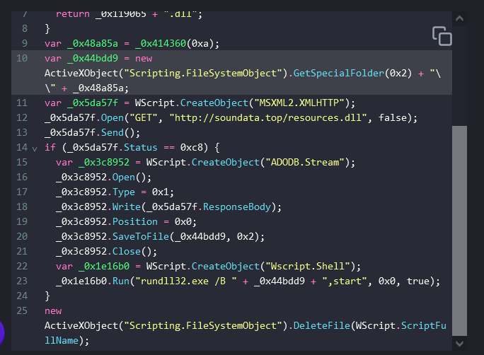

> # DanaBot

## Summary
- [Summary](#summary)
  - [Q1. What is the IP address used by the attacker in initial access?](#q1-what-is-the-ip-address-used-by-the-attacker-in-initial-access)
  - [Q2. What is the malicious file name used for initial access?](#q2-what-is-the-malicious-file-name-used-for-initial-access)
  - [Q3. What is the SHA256 hash of the mentioned file?](#q3-what-is-the-sha256-hash-of-the-mentioned-file)
  - [Q4. What is the process used to execute the malicious file?](#q4-what-is-the-process-used-to-execute-the-malicious-file)
  - [Q5. What is the extension of the second malicious file used by the attacker?](#q5-what-is-the-extension-of-the-second-malicious-file-used-by-the-attacker)
  - [Q6. What is the MD5 hash of the second malicious file?](#q6-what-is-the-md5-hash-of-the-second-malicious-file)
  - [Q7. What is the last malicious IP address in the PCAP that is known to be used as CnC by DanaBot?](#q7-what-is-the-last-malicious-ip-address-in-the-pcap-that-is-known-to-be-used-as-cnc-by-danabot)

### Q1. What is the IP address used by the attacker in initial access?
Go to `File -> Export Objects -> HTTP`, you will see there is a `dll` file. 
 
Export it then calcualte SHA256 hash and submit to [Virustotal](https://www.virustotal.com/gui/file/2597322a49a6252445ca4c8d713320b238113b3b8fd8a2d6fc1088a5934cee0e/behavior), you will see the traffic when the file is running. 
 
**Answer:** 62.173.146.41

### Q2. What is the malicious file name used for initial access?
At packet 11, there is request to `portfolio.serveirc.com` retrive file `login.php`. The response from the server has an attachment filename `allegato_708.js`. Use this [page](https://obf-io.deobfuscate.io/) to deobfuscate the code. 
 
The code will download the dll then execute it with `rundll32.exe`. 
**Answer:** allegato_708.js

### Q3. What is the SHA256 hash of the mentioned file?
**Answer:** 847b4ad90b1daba2d9117a8e05776f3f902dda593fb1252289538acf476c4268

### Q4. What is the process used to execute the malicious file?
The js file call to VBA objects, so the process to execute the file is `wscript.exe`. 
**Answer:** wscript.exe

### Q5. What is the extension of the second malicious file used by the attacker?
The code above will create a `.dll` file in temp folder. 
**Answer:** .dll

### Q6. What is the MD5 hash of the second malicious file?
Calculate hash of `resources.dll`. 
**Answer:** e758e07113016aca55d9eda2b0ffeebe

### Q7. What is the last malicious IP address in the PCAP that is known to be used as CnC by DanaBot?
Follow this [IOC](https://github.com/PaloAltoNetworks/Unit42-timely-threat-intel/blob/main/2024-02-14-IOCs-from-Danabot-infection.txt), there is three domain C2 of Danabot. 
Filter three IP in Wireshark to find which IP is the last to connect. 
 
**Answer:** 91.201.67.85
