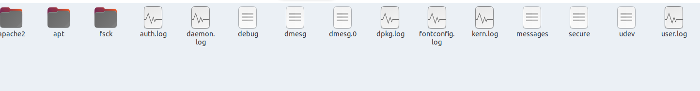

# Hammered

Attacked file contains log files. So, we need to know what each log file contains.<br/>
<br/>
- auth.log: Contains system authorization information, including user logins and authentication machinsm that were used, successful and failed attemps. (Chứa thông tin phân quyền hệ thống, bao gồm thông tin đăng nhập của người dùng và cơ chế chứng thực được sử dụng, đăng nhập thành công hay thất bại).
- daemon.log: Daemon logs contains information about events related running the Linux operation. (chứa thông tin về các sự kiện liên quan đến việc chạy các hoạt động dịch vụ Linux).
- debug: debug logs stores detailed message related to debugging and is useful for troubleshooting specific system operations. (chứa nội dung thông báo chi tiết liên quan đến việc debug và hữu ích để khắc phục sự cố hoạt động của hệ thống cụ thể)
- dmesg: also called as "driver message" or "display message" is used to examine the kernel ring buffer and print the message buffer of kernel. Contains the message produced by the device drivers. There are lot of message (log) generated during the system start-up. (Kiểm tra kernel ring buffer và in thông báo buffer của kernel. Chứa thông báo được tạo bởi driver của thiết bị. Có rất nhiều thông báo được tạo trong suốt quá trình máy khởi động)
- dmesg.0: dmesg from previous session, to see how computer crashed. (thông tin của lần khởi động trước đó của dmesg, có thể dùng kiểm tra tại sao máy crash)
- dpkg.log: contains information that are logged when a packages is installed or removed using dpkg command. (chứa thông tin khi một package được cài đặt hoặc xóa bỏ khỏi hệ thống dùng lệnh dpkg)
- fontconfig.log: contains information about new fonts are installed or removed. (chứa thông tin các font mới được cài hoặc xóa bỏ)
- kern.log: stores information from the Ubuntu Linux kernel. (lưu thông tin từ nhân của Ubuntu Linux)
- messages: Contains global system messages, including the message that are logged during system startup. There are several things that are logged in /var/log/messages including mail, cron, daemon, kern, auth, etc. (chứa thông tin tổng thể của hệ thống, bao gồm thông báo được ghi lại trong suốt quá trình khởi động. Có nhiều thứ khác như mail, cron tab, daemon, kẻn, auth, ...)
- secure: contains information related to authentication and authorization prilleges. For example, sshd logs all the message here, including unsuccessful login. (chứa thông tin liên quan đến việc chứng thực và phân quyền. Ví dụ, sshd ghi nhận tất cả thông báo ở đây, bao gồm cả việc đăng nhập không thành công)
- udev: when a device is plugged in or removed. It will output UEVENT blocks for the event from the kernel, and a following UDEV block; these are timestamped so you know how long it takes to process. The UDEV block contains more information, which udev adds through various helper programs. (khi một thiết bị được cắm vào hay rút ra, nó sẽ xuất hiện các khối UDEV sau; chúng được đánh dấu thời gian để bạn biết mất bao lâu để xử lý. Khối UDEV chứa nhiều thông tin hơn, udev bổ sung thêm thông qua các chương trình hỗ trợ khác nhau)
- user.log: contains behavior information of user. (chứa thông tin hành vi của người dùng)
<br/>More information about Linux's logs [here](https://www.eurovps.com/blog/important-linux-log-files-you-must-be-monitoring/#:~:text=Log%20files%20are%20a%20set,the%20%2Fvar%2Flog%20directory.)
- apache2/www-access.log: apache stores information about incoming requests. (chứa thông tin về các yêu cầu được gửi đến phía máy chủ)
- apache2/www-error.log: contains information about errors that the web server encountered while processing request. (chứa thông tin các lỗi mà web server gặp phải khi xử lý các yêu cầu)
- apache2/www-media.log: stores information about incoming requests others resources in web server. (chứa thông tin các yêu cầu đến các tài nguyên khác trong hệ thống)
- apt/term.log: history of apt command. (lịch sử thực hiện lênh với apt)
- fsck: checking the consistency of a file system in Unix and Unix-like OS. (kiểm tra tính nhất quá của một file trong hệ thống)

* ## Summary
    * [Q1. Which service did the attackers use to gain access to the system?](#q1-which-service-did-the-attackers-use-to-gain-access-to-the-system)
    * [Q2. What is the operating system version of the targeted system? (one word)](#q2-what-is-the-operating-system-version-of-the-targeted-system-one-word)
    * [Q3. What is the name of the compromised account?](#q3-what-is-the-name-of-the-compromised-account)
    * [Q4. Consider that each unique IP represents a different attacker. How many attackers were able to get access to the system?](#q4-consider-that-each-unique-ip-represents-a-different-attacker-how-many-attackers-were-able-to-get-access-to-the-system)
    * [Q5. Which attacker's IP address successfully logged into the system the most number of times?](#q5-which-attackers-ip-address-successfully-logged-into-the-system-the-most-number-of-times)
    * [Q6. How many requests were sent to the Apache Server?](#q6-how-many-requests-were-sent-to-the-apache-server)
    * [Q7. How many rules have been added to the firewall?](#q7-how-many-rules-have-been-added-to-the-firewall)
    * [Q8. One of the downloaded files to the target system is a scanning tool. Provide the tool name.](#q8-one-of-the-downloaded-files-to-the-target-system-is-a-scanning-tool-provide-the-tool-name)
    * [Q9. When was the last login from the attacker with IP 219.150.161.20? Format: MM/DD/YYYY HH:MM:SS AM](#q9-when-was-the-last-login-from-the-attacker-with-ip-21915016120-format-mmddyyyy-hhmmss-am)
    * [Q10. The database displayed two warning messages, provide the most important and dangerous one.](#q10-the-database-displayed-two-warning-messages-provide-the-most-important-and-dangerous-one)
    * [Q11. Multiple accounts were created on the target system. Which one was created on Apr 26 04:43:15?](#q11-multiple-accounts-were-created-on-the-target-system-which-one-was-created-on-apr-26-044315)
    * [Q12. Few attackers were using a proxy to run their scans. What is the corresponding user-agent used by this proxy?](#q12-few-attackers-were-using-a-proxy-to-run-their-scans-what-is-the-corresponding-user-agent-used-by-this-proxy)

### Q1. Which service did the attackers use to gain access to the system?
We will check in auth.log with `grep "fail" auth.log` command.<br/>
```shell
pam_unix(sshd:auth): authentication failure; logname= uid=0 euid=0 tty=ssh ruser= rhost=8.12.45.242  user=root
pam_unix(sshd:auth): authentication failure; logname= uid=0 euid=0 tty=ssh ruser= rhost=8.12.45.242  user=root
pam_unix(sshd:auth): authentication failure; logname= uid=0 euid=0 tty=ssh ruser= rhost=8.12.45.242  user=root
pam_unix(sshd:auth): authentication failure; logname= uid=0 euid=0 tty=ssh ruser= rhost=8.12.45.242  user=root
pam_unix(sshd:auth): authentication failure; logname= uid=0 euid=0 tty=ssh ruser= rhost=8.12.45.242  user=root
pam_unix(sshd:auth): authentication failure; logname= uid=0 euid=0 tty=ssh ruser= rhost=8.12.45.242  user=root
pam_unix(sshd:auth): authentication failure; logname= uid=0 euid=0 tty=ssh ruser= rhost=8.12.45.242  user=root
pam_unix(sshd:auth): authentication failure; logname= uid=0 euid=0 tty=ssh ruser= rhost=8.12.45.242  user=root
pam_unix(sshd:auth): authentication failure; logname= uid=0 euid=0 tty=ssh ruser= rhost=8.12.45.242 
```
We see many lines with sshd failure attemps.<br/>
**Answer:** SSH

### Q2. What is the operating system version of the targeted system? (one word)
Because we need to get OS version. Therefor, the file is checked is `dmesg`, system information is loaded when devices start-up, so we will run the `head` command to check.<br/>
```shell
$ head dmesg
[    0.000000] Initializing cgroup subsys cpuset
[    0.000000] Initializing cgroup subsys cpu
[    0.000000] Linux version 2.6.24-26-server (buildd@crested) (gcc version 4.2.4 (Ubuntu 4.2.4-1ubuntu3)) #1 SMP Tue Dec 1 18:26:43 UTC 2009 (Ubuntu 2.6.24-26.64-server)
[    0.000000] Command line: root=UUID=a691743a-a4b7-482d-95ff-406e5acd83a3 ro quiet splash
[    0.000000] BIOS-provided physical RAM map:
[    0.000000]  BIOS-e820: 0000000000000000 - 000000000009f800 (usable)
[    0.000000]  BIOS-e820: 000000000009f800 - 00000000000a0000 (reserved)
[    0.000000]  BIOS-e820: 00000000000ca000 - 00000000000cc000 (reserved)
[    0.000000]  BIOS-e820: 00000000000dc000 - 00000000000e4000 (reserved)
[    0.000000]  BIOS-e820: 00000000000e8000 - 0000000000100000 (reserved)
```
**Answer:** 4.2.4-1ubuntu3

### Q3. What is the name of the compromised account?
Almost attemp has uid=0, so it may be `root`.<br/>
**Answer:** root

### Q4. Consider that each unique IP represents a different attacker. How many attackers were able to get access to the system?
First we need to output all IP which have many failure attemps.<br/>
Use `grep, awk, sort, uniq`.<br/>
```shell
$ grep "authentication failure" auth.log | awk '{print $14}' | sort | uniq -c | sort -n
      1 rhost=10.0.1.4
      1 rhost=12.172.224.140
      1 rhost=208.80.69.74
      1 rhost=65.88.2.5
      1 rhost=76-191-195-140.dsl.dynamic.sonic.net
      1 rhost=94.52.185.9
      2 rhost=190.166.87.164
      2 rhost=83.216.63.124
      2 rhost=adsl-71-132-129-212.dsl.pltn13.pacbell.net
      2 rhost=host-188-131-23-37.hspa.orange.md
      3 rhost=222.240.223.88
      3 rhost=89.46.213.128
      3 rhost=cpe-24-94-90-96.hawaii.res.rr.com
      4 rhost=78.38.27.21
      5 tty=ssh
      7 rhost=122.165.9.200
      9 rhost=218.56.61.114
     10 rhost=190.4.21.190
     13 rhost=61.151.246.140
     15 rhost=220.170.79.247
     22 rhost=
     26 rhost=200.72.254.54
     28 rhost=219.139.243.236
     34 rhost=122.102.64.54
     51 rhost=59.46.39.148
     79 rhost=mail.mediamonitors.com.pk
     97 rhost=114.80.166.219
     97 rhost=201.64.234.2
    113 rhost=125.235.4.130
    121 rhost=209.59.222.166
    145 rhost=jp.user2pastoreinc.com
    158 rhost=124.51.108.68
    168 rhost=d192-24-91-113.try.wideopenwest.com
    171 rhost=system.firefoxlanka.com
    180 rhost=116.6.19.70
    213 rhost=61.168.227.12
    263 rhost=58.17.30.49
    306 rhost=65.208.122.48
    427 rhost=217.15.55.133
    455 rhost=211.154.254.248
    513 rhost=122.226.202.12
    646 rhost=222.169.224.197
    650 rhost=124.207.117.9
   1435 rhost=121.11.66.70
   1573 rhost=222.66.204.246
   3037 rhost=8.12.45.242
   9259 rhost=219.150.161.20
```
We have many IP attemp brute-force. Then we filter which IP succesfull login to system.
```shell
$ grep "Accepted password for" auth.log | awk '{print $11}' | sort | uniq -c | sort -n
      1 151.81.204.141
      1 151.81.205.100
      1 151.82.3.201
      1 166.129.196.88
      1 188.131.22.69
      1 190.167.70.87
      1 193.1.186.197
      1 201.229.176.217
      1 208.80.69.70
      1 222.169.224.197
      1 222.66.204.246
      1 61.168.227.12
      1 67.164.72.181
      2 121.11.66.70
      2 122.226.202.12
      2 208.80.69.69
      2 65.195.182.120
      2 94.52.185.9
      3 190.167.74.184
      3 192.168.126.1
      4 10.0.1.4
      4 188.131.23.37
      4 219.150.161.20
      5 71.132.129.212
      6 65.88.2.5
      7 208.80.69.74
     14 10.0.1.2
     22 76.191.195.140
     23 190.166.87.164
```
Compare with the IP list above, we have 6 IP successful login to system include 219.150.161.20, 222.66.204.246, 121.11.66.70, 222.169.224.197, 122.226.202.12, 61.168.227.12<br/>
**Answer:** 6

### Q5. Which attacker's IP address successfully logged into the system the most number of times?
As we see in Q4, IP 219.150.161.20 has the most logins.<br/>
**Answer:** 219.150.161.20

### Q6. How many requests were sent to the Apache Server?
We only need to count the number of lines in apache2/www-access.log<br/>
```shell
$ cat www-access.log | wc -l
365
```
**Answer:** 365

### Q7. How many rules have been added to the firewall?
We have known that built-in firewall in Linux is iptables, so I only execute `grep` to filter iptables.<br/>
```shell
$ grep 'iptables' auth.log 
Apr 15 12:49:09 app-1 sudo:   user1 : TTY=pts/0 ; PWD=/opt/software/web/app ; USER=root ; COMMAND=/usr/bin/tee ../templates/proxy/iptables.conf
Apr 15 15:06:13 app-1 sudo:   user1 : TTY=pts/1 ; PWD=/opt/software/web/app ; USER=root ; COMMAND=/usr/bin/tee ../templates/proxy/iptables.conf
Apr 15 15:17:45 app-1 sudo:   user1 : TTY=pts/1 ; PWD=/opt/software/web/app ; USER=root ; COMMAND=/usr/bin/tee ../templates/proxy/iptables.conf
Apr 15 15:18:23 app-1 sudo:   user1 : TTY=pts/1 ; PWD=/opt/software/web/app ; USER=root ; COMMAND=/usr/bin/tee ../templates/proxy/iptables.conf
Apr 24 19:25:37 app-1 sudo:     root : TTY=pts/2 ; PWD=/etc ; USER=root ; COMMAND=/sbin/iptables -L
Apr 24 20:03:06 app-1 sudo:     root : TTY=pts/2 ; PWD=/etc ; USER=root ; COMMAND=/sbin/iptables -A INPUT -p ssh -dport 2424 -j ACCEPT
Apr 24 20:03:44 app-1 sudo:     root : TTY=pts/2 ; PWD=/etc ; USER=root ; COMMAND=/sbin/iptables -A INPUT -p tcp -dport 53 -j ACCEPT
Apr 24 20:04:13 app-1 sudo:     root : TTY=pts/2 ; PWD=/etc ; USER=root ; COMMAND=/sbin/iptables -A INPUT -p udp -dport 53 -j ACCEPT
Apr 24 20:06:22 app-1 sudo:     root : TTY=pts/2 ; PWD=/etc ; USER=root ; COMMAND=/sbin/iptables -A INPUT -p tcp --dport ssh -j ACCEPT
Apr 24 20:11:00 app-1 sudo:     root : TTY=pts/2 ; PWD=/etc ; USER=root ; COMMAND=/sbin/iptables -A INPUT -p tcp --dport 53 -j ACCEPT
Apr 24 20:11:08 app-1 sudo:     root : TTY=pts/2 ; PWD=/etc ; USER=root ; COMMAND=/sbin/iptables -A INPUT -p tcp --dport 113 -j ACCEPT
```
As the result, we have 6 rules.<br/>
**Answer:** 6

### Q8. One of the downloaded files to the target system is a scanning tool. Provide the tool name.
Check apt/term.log, we have known `nmap` is a scanning tool very popular, so I use `grep` to filter nmap first and have the result below.<br/>
```shell
$ grep "nmap" apt/term.log 
Selecting previously deselected package nmap.
Unpacking nmap (from .../archives/nmap_4.53-3_amd64.deb) ...
Setting up nmap (4.53-3) ...
```
**Answer:** nmap

### Q9. When was the last login from the attacker with IP 219.150.161.20? Format: MM/DD/YYYY HH:MM:SS AM
Check auth.log, filter with "Accepted password" and "219.150.161.20", then use `exiftool` to get the year.<br/>
```shell
$ grep "Accepted password" auth.log | grep "219.150.161.20"
Apr 19 05:41:44 app-1 sshd[8810]: Accepted password for root from 219.150.161.20 port 51249 ssh2
Apr 19 05:42:27 app-1 sshd[9031]: Accepted password for root from 219.150.161.20 port 40877 ssh2
Apr 19 05:55:20 app-1 sshd[12996]: Accepted password for root from 219.150.161.20 port 55545 ssh2
Apr 19 05:56:05 app-1 sshd[13218]: Accepted password for root from 219.150.161.20 port 36585 ssh2

$ exiftool auth.log 
ExifTool Version Number         : 11.88
File Name                       : auth.log
Directory                       : .
File Size                       : 9.8 MB
File Modification Date/Time     : 2010:07:03 17:53:20+07:00
File Access Date/Time           : 2022:01:11 09:22:01+07:00
File Inode Change Date/Time     : 2022:01:11 09:20:12+07:00
File Permissions                : rwxrwxrwx
File Type                       : TXT
File Type Extension             : txt
MIME Type                       : text/plain
MIME Encoding                   : us-ascii
Newlines                        : Unix LF
Line Count                      : 102164
Word Count                      : 1289927
```

**Answer:** 04/19/2010 05:56:05 AM

### Q10. The database displayed two warning messages, provide the most important and dangerous one.
Check daemon.log, because database will run as a service so its information will store in daemon.log. Use `grep` filter "mysql" and "WARNING".<br/>
```shell
$ grep "mysql" daemon.log | grep "WARNING"
Mar 18 10:18:42 app-1 /etc/mysql/debian-start[7566]: WARNING: mysql.user contains 2 root accounts without password!
Mar 18 17:01:44 app-1 /etc/mysql/debian-start[14717]: WARNING: mysql.user contains 2 root accounts without password!
Mar 22 13:49:49 app-1 /etc/mysql/debian-start[5599]: WARNING: mysql.user contains 2 root accounts without password!
Mar 22 18:43:41 app-1 /etc/mysql/debian-start[4755]: WARNING: mysql.user contains 2 root accounts without password!
Mar 22 18:45:25 app-1 /etc/mysql/debian-start[4749]: WARNING: mysql.user contains 2 root accounts without password!
Mar 25 11:56:53 app-1 /etc/mysql/debian-start[4848]: WARNING: mysql.user contains 2 root accounts without password!
Apr 14 14:44:34 app-1 /etc/mysql/debian-start[5369]: WARNING: mysql.user contains 2 root accounts without password!
Apr 14 14:44:36 app-1 /etc/mysql/debian-start[5624]: WARNING: mysqlcheck has found corrupt tables
Apr 18 18:04:00 app-1 /etc/mysql/debian-start[4647]: WARNING: mysql.user contains 2 root accounts without password!
Apr 24 20:21:24 app-1 /etc/mysql/debian-start[5427]: WARNING: mysql.user contains 2 root accounts without password!
Apr 28 07:34:26 app-1 /etc/mysql/debian-start[4782]: WARNING: mysql.user contains 2 root accounts without password!
Apr 28 07:34:27 app-1 /etc/mysql/debian-start[5032]: WARNING: mysqlcheck has found corrupt tables
May  2 23:05:54 app-1 /etc/mysql/debian-start[4774]: WARNING: mysql.user contains 2 root accounts without password!
```
**Answer:** mysql.user contains 2 root accounts without password!

### Q11. Multiple accounts were created on the target system. Which one was created on Apr 26 04:43:15?
Check auth.log, to create account we have to use `useradd` command, so use grep filter it.<br/>
```shell
$ grep "useradd" auth.log | grep "Apr 26 04:43:15"
Apr 26 04:43:15 app-1 useradd[20115]: new user: name=wind3str0y, UID=1004, GID=1005, home=/home/wind3str0y, shell=/bin/bash
```
**Answer:** wind3str0y

### Q12. Few attackers were using a proxy to run their scans. What is the corresponding user-agent used by this proxy?
Check apache2/www-access.log, use `grep` to filter field User-Agent, then `sort` and `uniq`.<br/>
```shell
$ cat apache2/www-access.log | cut -d ' ' -f 12 | sort | uniq
"-"
"Apple-PubSub/65.12.1"
"Mozilla/4.0
"Mozilla/5.0
"pxyscand/2.1"
"WordPress/2.9.2;
```
As the result, we found a strange User-Agent at line 5.<br/>
**Answer:** pxyscand/2.1