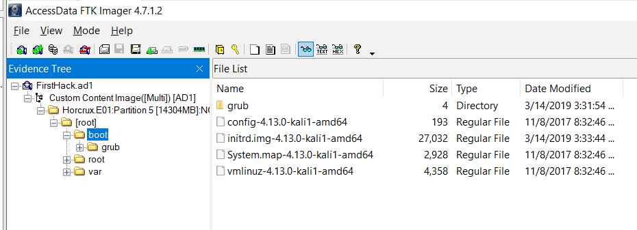
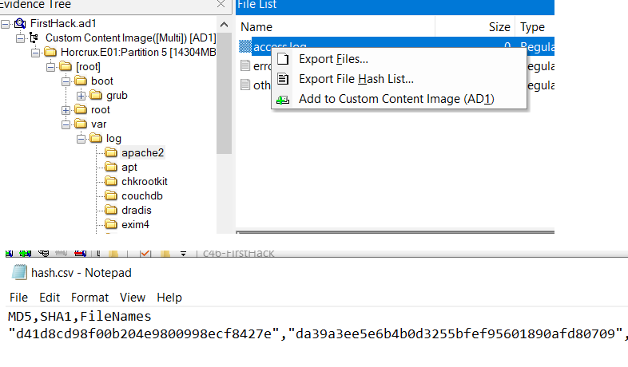
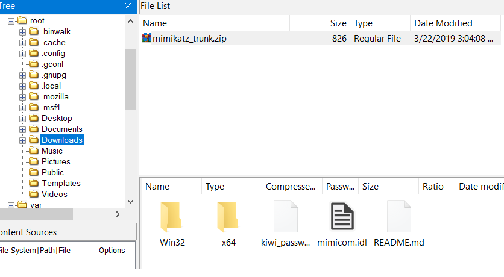
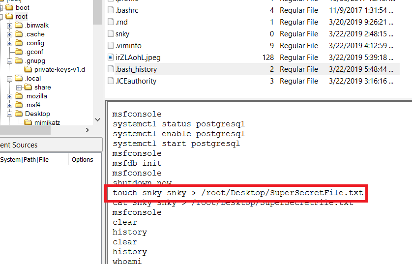
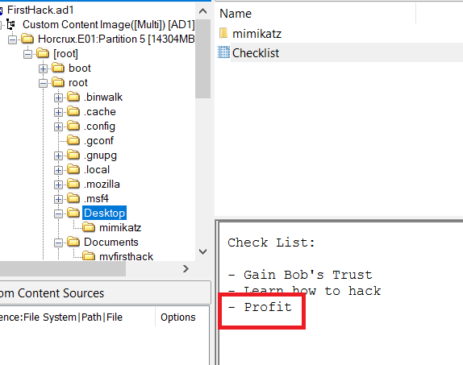
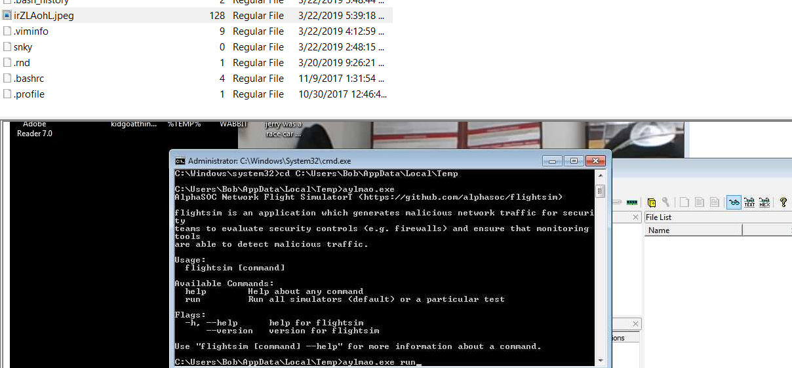
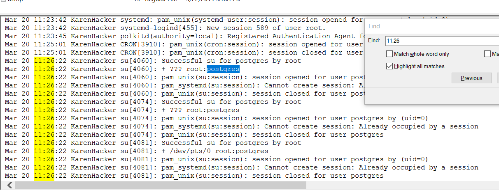

# Insider Blue Team Lab

## Summary
- [Insider Blue Team Lab](#insider-blue-team-lab)
  - [Summary](#summary)
    - [Q1. What distribution of Linux is being used on this machine?](#q1-what-distribution-of-linux-is-being-used-on-this-machine)
    - [Q2. What is the MD5 hash of the apache access.log?](#q2-what-is-the-md5-hash-of-the-apache-accesslog)
    - [Q3. It is believed that a credential dumping tool was downloaded? What is the file name of the download](#q3-it-is-believed-that-a-credential-dumping-tool-was-downloaded-what-is-the-file-name-of-the-download)
    - [Q4. There was a super-secret file created. What is the absolute path?](#q4-there-was-a-super-secret-file-created-what-is-the-absolute-path)
    - [Q5. What program used didyouthinkwedmakeiteasy.jpg during execution?](#q5-what-program-used-didyouthinkwedmakeiteasyjpg-during-execution)
    - [Q6. What is the third goal from the checklist Karen created?](#q6-what-is-the-third-goal-from-the-checklist-karen-created)
    - [Q7. How many times was apache run?](#q7-how-many-times-was-apache-run)
    - [Q8. It is believed this machine was used to attack another. What file proves this?](#q8-it-is-believed-this-machine-was-used-to-attack-another-what-file-proves-this)
    - [Q9. Within the Documents file path, it is believed that Karen was taunting a fellow computer expert through a bash script. Who was Karen taunting?](#q9-within-the-documents-file-path-it-is-believed-that-karen-was-taunting-a-fellow-computer-expert-through-a-bash-script-who-was-karen-taunting)
    - [Q10. A user su'd to root at 11:26 multiple times. Who was it?](#q10-a-user-sud-to-root-at-1126-multiple-times-who-was-it)
    - [Q11. Based on the bash history, what is the current working directory?](#q11-based-on-the-bash-history-what-is-the-current-working-directory)

### Q1. What distribution of Linux is being used on this machine?
Open thi given file in `FTK Image`, then navigate to `boot` to folder, you will see the distro of linux. 
 
**Answer:** kali

### Q2. What is the MD5 hash of the apache access.log?
The path to file is `\var\log\apache2\access.log`, you can export file hash list or export file then calculate hash. 
 
**Answer:** d41d8cd98f00b204e9800998ecf8427e

### Q3. It is believed that a credential dumping tool was downloaded? What is the file name of the download
It's in `Downloads` folder. 
 
**Answer:** mimikatz_trunk.zip

### Q4. There was a super-secret file created. What is the absolute path?
View `.bash_hostory` of `root` user, you will see the attacker create a secret file on the `Desktop` folder. 
 
**Answer:** /root/Desktop/SuperSecretFile.txt

### Q5. What program used didyouthinkwedmakeiteasy.jpg during execution?
At the end of `.bash_history`, the image was used with `binwalk`. 
**ANswer:** binwalk

### Q6. What is the third goal from the checklist Karen created?
The `checklist` is in `Desktop` folder. 
 
**Answer:** Profit

### Q7. How many times was apache run?
As we see from Q2, the size of all log file is 0, so the `apache2` service has never used. 
**Answer:** 0

### Q8. It is believed this machine was used to attack another. What file proves this?
In `root` folder has an image that the tool [https://github.com/alphasoc/flightsim](https://github.com/alphasoc/flightsim) was use to generate malicious traffic. 
 
**Answer:** irZLAohL.jpeg

### Q9. Within the Documents file path, it is believed that Karen was taunting a fellow computer expert through a bash script. Who was Karen taunting?
In `firstscript_fixed`, the attacker was taunting to Young. 
**Answer:** Young

### Q10. A user su'd to root at 11:26 multiple times. Who was it?
In almost Linux distro, the file `/var/log/auth.log` store all login attempt to system. Follow to this file and search for `11:26`. 
 
**Answer:** postgres

### Q11. Based on the bash history, what is the current working directory?
The current working directry is `/root/Documents/myfirsthack/`
**Answer:** /root/Documents/myfirsthack/
