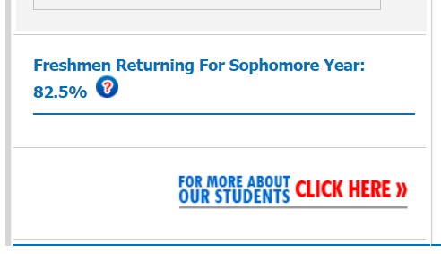
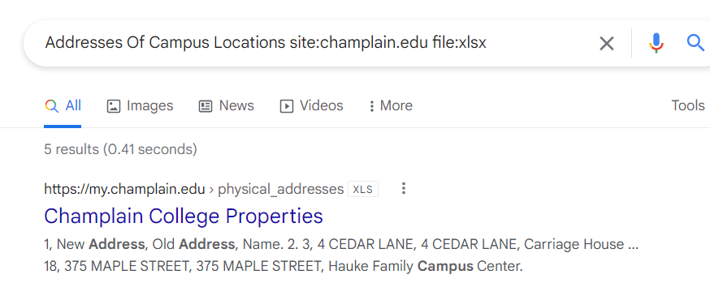
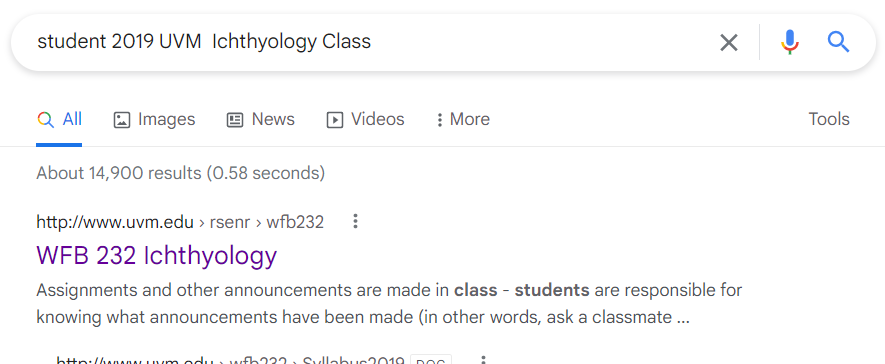
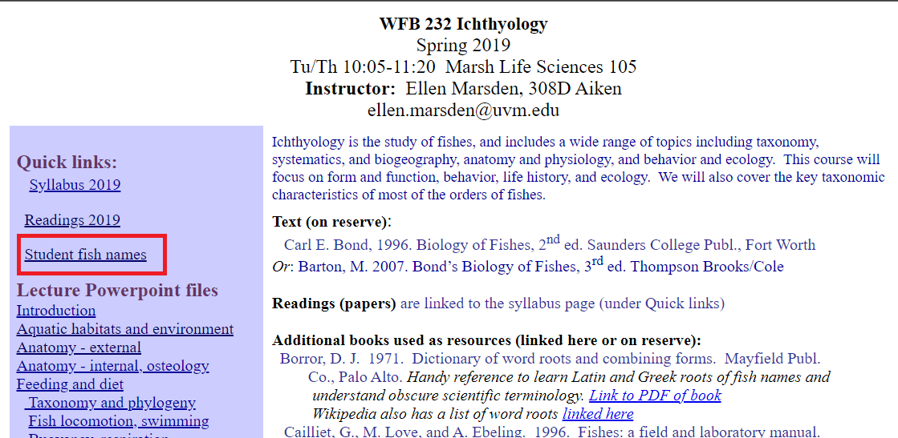

# Intel101

* ## Summary
   * [Q1. Who is the Registrar for jameskainth.com?](#q1-who-is-the-registrar-for-jameskainthcom)
   * [Q2. You get a phone call from this number: 855-707-7328, they were previously known by another name? (No spaces between words)](#q2-you-get-a-phone-call-from-this-number-855-707-7328-they-were-previously-known-by-another-name-no-spaces-between-words)
   * [Q3. What is the Zoom meeting id of the British Prime Ministers Cabinet Meeting?](#q3-what-is-the-zoom-meeting-id-of-the-british-prime-ministers-cabinet-meeting)
   * [Q4. What Percentage of full-time degree-seeking freshmen from the fall of 2018 re-enrolled to Champlain in the fall of 2019?](#q4-what-percentage-of-full-time-degree-seeking-freshmen-from-the-fall-of-2018-re-enrolled-to-champlain-in-the-fall-of-2019)
   * [Q5. Champlain College Has A Public Excel Sheet Listing Addresses Of Campus Locations Available on The Internet, what’s the SHA256 hash of the excel file?](#q5-champlain-college-has-a-public-excel-sheet-listing-addresses-of-campus-locations-available-on-the-internet-whats-the-sha256-hash-of-the-excel-file)
   * [Q6. In 1998 specifically on February 12th, Champlain was planning on adding an exciting new building to its campus. Back then, it was called “The Information Commons”. Can you find a picture of what the inside would look like? Upload the sha256 hash here.](#q6-in-1998-specifically-on-february-12th-champlain-was-planning-on-adding-an-exciting-new-building-to-its-campus-back-then-it-was-called-the-information-commons-can-you-find-a-picture-of-what-the-inside-would-look-like-upload-the-sha256-hash-here)
   * [Q7. One of Champlain College's Cyber Security Faculty got a bachelor's degree in arts from this Ohioan university. Who was the other faculty member who studied there? (FirstName LastName - two words)](#q7-one-of-champlain-colleges-cyber-security-faculty-got-a-bachelors-degree-in-arts-from-this-ohioan-university-who-was-the-other-faculty-member-who-studied-there-firstname-lastname---two-words)
   * [Q8. In 2019 UVM’s Ichthyology Class Had to Name their fish for class. Can you find out what the last person on the public roster named their fish?](#q8-in-2019-uvms-ichthyology-class-had-to-name-their-fish-for-class-can-you-find-out-what-the-last-person-on-the-public-roster-named-their-fish)
   * [Q9. Can You Figure Out Which State This Picture Has Been Taken From? See attached photo](#q9-can-you-figure-out-which-state-this-picture-has-been-taken-from-see-attached-photo)

### Q1. Who is the Registrar for jameskainth.com?
Use `whois` to get all information about jameskainth.com.<br/>
```ps
➜ whois64.exe jameskainth.com | findstr.exe "Registrar"
   Registrar URL: http://www.namecheap.com
   Registrar: NameCheap, Inc.
   Registrar IANA ID: 1068
   Registrar Abuse Contact Email: abuse@namecheap.com
   Registrar Abuse Contact Phone: +1.6613102107
Registrars.
Registrar URL: http://www.namecheap.com
Registrar Registration Expiration Date: 2026-01-07T21:35:46.00Z
Registrar: NAMECHEAP INC
Registrar IANA ID: 1068
Registrar Abuse Contact Email: abuse@namecheap.com
Registrar Abuse Contact Phone: +1.9854014545
Registrar WHOIS Server: whois.namecheap.com
Registrar URL: http://www.namecheap.com
Registrar Registration Expiration Date: 2026-01-07T21:35:46.00Z
Registrar: NAMECHEAP INC
Registrar IANA ID: 1068
Registrar Abuse Contact Email: abuse@namecheap.com
Registrar Abuse Contact Phone: +1.9854014545
```
**Answer:** NAMECHEAP

### Q2. You get a phone call from this number: 855-707-7328, they were previously known by another name? (No spaces between words)
After research OSINT tool for phonenumber, I found [Intelligence X](https://intelx.io/tools). Select Phone Number.
<br/>
I found the current owner is Spectrum.
<br/>
Search on Google for previous name.
<br/>
**Answer:** 

### Q3. What is the Zoom meeting id of the British Prime Ministers Cabinet Meeting?
Search on Google with keyword `zoom British Prime Ministers Cabinet Meeting`.<br/>
<br/>
In this page, you'll see a image contains Zoom ID.<br/>
<br/>
**Answer:** 539544323

### Q4. What Percentage of full-time degree-seeking freshmen from the fall of 2018 re-enrolled to Champlain in the fall of 2019?
Search on Google with the question from lab.<br/>
<br/>
From this page, we will know the percentage is 82%, but format of answer requires a more accurate answer upto a decimal place.
<br/>
Below is another link give us useful information.<br/>
<br/>
But we only have the result of 2020.<br/>
<br/>
So, we need to use [Wayback Machine](https://archive.org/web/) to find percentage of 2019.<br/>
<br/>
Select 2020, choose snapshot in May.<br/>
<br/>
The result is display.<br/>
<br/>
**Answer:** 82.5%

### Q5. Champlain College Has A Public Excel Sheet Listing Addresses Of Campus Locations Available on The Internet, what’s the SHA256 hash of the excel file?
Search on Google for formal website of Champlain College.<br/>
<br/>
Then use information from question combine with Google Dorking technique to extract needed file.<br/>
<br/>
Contents:<br/>
<br/>
Calculate SHA256.<br/>
```ps
➜ sha256sum.exe .\physical_addresses.xls
\c96ee03c4043c366c6f573bb1d194dec8f4c0c81150c60d310bc59d9e17a6906 *.\\physical_addresses.xls
```
**Answer:** c96ee03c4043c366c6f573bb1d194dec8f4c0c81150c60d310bc59d9e17a6906

### Q6. In 1998 specifically on February 12th, Champlain was planning on adding an exciting new building to its campus. Back then, it was called “The Information Commons”. Can you find a picture of what the inside would look like? Upload the sha256 hash here.
Use [Wayback Machine](https://archive.org/web/) again. Select 1998.<br/>
On Feb 12th, they have a snapshot.<br/>
<br/>
In this snapshot, we see `Information Commons Project`.<br/>
<br/>
In this page, we see an image represents the inside design of this building.<br/>
<br/>
Download and calculate sha256.
```ps
➜ sha256sum.exe .\inside1.jpg
\f4952b314eb15acf0eec79c954f83881c17d50d2b5922ee37e8fc5e5cd1aeac2 *.\\inside1.jpg
```
**Answer:** f4952b314eb15acf0eec79c954f83881c17d50d2b5922ee37e8fc5e5cd1aeac2

### Q7. One of Champlain College's Cyber Security Faculty got a bachelor's degree in arts from this Ohioan university. Who was the other faculty member who studied there? (FirstName LastName - two words)
Search on Google about Cybersecurity Faculty of Champlain College.<br/>
<br/>
Follow this link, we found lectures of Cybersecurity Faculty. After reading info of each lecture, I found a lecture have Bachelor of Arts from University of Toledo (Ohio State).
<br/>
Find other lecture who studied there using Google Dorking Techniques, `inurl:champlain.edu intext:University of Toledo, Bachelor of Arts`.<br/>
<br/>
We found lecture studied here and also a member of Cybersecurity Faculty.<br/>
<br/>

### Q8. In 2019 UVM’s Ichthyology Class Had to Name their fish for class. Can you find out what the last person on the public roster named their fish?
Search on Google with key `student 2019 UVM  Ichthyology Class`.<br/>
<br/>
Follow this link, we detect a quick link named `Students fish name`.<br/>
<br/>
This link give us an excel file contains two columns Name and their fish name. The last person is Wilkins, Dylan D. and his fish name is Saccopharyngiformes.
<br/>
**Answer:** saccopharyngiformes

### Q9. Can You Figure Out Which State This Picture Has Been Taken From? See attached photo
Use Bing Search Engine with `Visual Search`, I found an image quite similar to the statue in attached image.<br/>
<br/>
There is Dinosaur Land.<br/>
<br/>
Use this name to search for State.
<br/>
**Answer:** Virginia