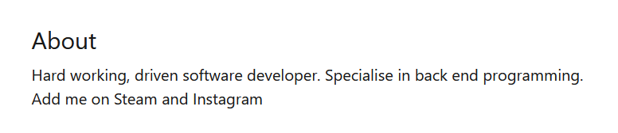

> # Lespion 

## Summary
- [Summary](#summary)
  - [Q1. File -\> Github.txt: What is the API key the insider added to his GitHub repositories?](#q1-file---githubtxt-what-is-the-api-key-the-insider-added-to-his-github-repositories)
  - [Q2. File -\> Github.txt: What is the plaintext password the insider added to his GitHub repositories?](#q2-file---githubtxt-what-is-the-plaintext-password-the-insider-added-to-his-github-repositories)
  - [Q3. File -\> Github.txt: What cryptocurrency mining tool did the insider use?](#q3-file---githubtxt-what-cryptocurrency-mining-tool-did-the-insider-use)
  - [Q4. What university did the insider go to?](#q4-what-university-did-the-insider-go-to)
  - [Q5. What gaming website the insider had an account on?](#q5-what-gaming-website-the-insider-had-an-account-on)
  - [Q6. What is the link to the insider Instagram profile?](#q6-what-is-the-link-to-the-insider-instagram-profile)
  - [Q7. Where did the insider go on the holiday? (Country only)](#q7-where-did-the-insider-go-on-the-holiday-country-only)
  - [Q8. Where is the insider family live? (City only)](#q8-where-is-the-insider-family-live-city-only)
  - [Q9. File -\> office.jpg: You have been provided with a picture of the building in which the company has an office. Which city is the company located in?](#q9-file---officejpg-you-have-been-provided-with-a-picture-of-the-building-in-which-the-company-has-an-office-which-city-is-the-company-located-in)
  - [Q10. File -\> Webcam.png: With the intel, you have provided, our ground surveillance unit is now overlooking the person of interest suspected address. They saw them leaving their apartment and followed them to the airport. Their plane took off and has landed in another country. Our intelligence team spotted the target with this IP camera. Which state is this camera in?](#q10-file---webcampng-with-the-intel-you-have-provided-our-ground-surveillance-unit-is-now-overlooking-the-person-of-interest-suspected-address-they-saw-them-leaving-their-apartment-and-followed-them-to-the-airport-their-plane-took-off-and-has-landed-in-another-country-our-intelligence-team-spotted-the-target-with-this-ip-camera-which-state-is-this-camera-in)

### Q1. File -> Github.txt: What is the API key the insider added to his GitHub repositories?
Follow the github link, you will the repo named `Project-Build---Custom-Login-Page`, and the `LoginPage.js` contains the API key. 
 
**Anwer:** aJFRaLHjMXvYZgLPwiJkroYLGRkNBW

### Q2. File -> Github.txt: What is the plaintext password the insider added to his GitHub repositories?
Also in `LoginPage.js`, the password appear in base64 string, we decode it to retrive the cleartext. 
 
**Answer:** PicassoBaguette99 

### Q3. File -> Github.txt: What cryptocurrency mining tool did the insider use?
The insider forked XMRig repo, this tool is the cryptocurrency mining tool. 
 
**Answer:** XMRig

### Q4. What university did the insider go to?
The insider has a linkedin account, [link](https://fr.linkedin.com/in/%C3%A9milie-marseille-4b353a1aa). 
 
**Answer:** Sorbonne

### Q5. What gaming website the insider had an account on?
The insider has steam acocunt. 
 
**Answer:** steam

### Q6. What is the link to the insider Instagram profile?
Search his username on Instagram. 
 
**Answer:** https://www.instagram.com/emarseille99/

### Q7. Where did the insider go on the holiday? (Country only)
On Instagram, he takes a photo when on holidays, use Google Lens to find where he was. 
 
 
This place is `Marina By Stand` in Singapore. 
**Answer:** Singapore

### Q8. Where is the insider family live? (City only)
Use Google Lens, I see the UAE flag in this [post](https://www.instagram.com/p/CAjCdGrldGr/)
 
In other post, I see many skyscraper so I search which city has many skyscraper in UAE. 
 
**Answer:** Dubai

### Q9. File -> office.jpg: You have been provided with a picture of the building in which the company has an office. Which city is the company located in?
Use Google Lens, almost images are refer to Birmingham city. 
 
**Answer:** Birmingham

### Q10. File -> Webcam.png: With the intel, you have provided, our ground surveillance unit is now overlooking the person of interest suspected address. They saw them leaving their apartment and followed them to the airport. Their plane took off and has landed in another country. Our intelligence team spotted the target with this IP camera. Which state is this camera in?
Use Google Lens, this place is Notra Dame University. 
 
Find this University is in which state. 
 
**Answer:** Indiana
