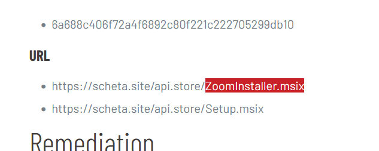

> # MSIXPhish

## Summary
- [Summary](#summary)
  - [Q1. To effectively mitigate the threat, it's important to determine the origin or category of this malware. Can you identify which malware family this sample is associated with to better understand its typical behaviors and associated risks?](#q1-to-effectively-mitigate-the-threat-its-important-to-determine-the-origin-or-category-of-this-malware-can-you-identify-which-malware-family-this-sample-is-associated-with-to-better-understand-its-typical-behaviors-and-associated-risks)
  - [Q2. It's important to identify the malware's first public appearance to effectively track its history and spread. Can you provide the initial submission date and time of this malware on VirusTotal?](#q2-its-important-to-identify-the-malwares-first-public-appearance-to-effectively-track-its-history-and-spread-can-you-provide-the-initial-submission-date-and-time-of-this-malware-on-virustotal)
  - [Q3. Recognizing a specific MITRE technique employed by the malware helps develop targeted defense strategies. What's the MITRE ID of the technique used by the malware for data collection?](#q3-recognizing-a-specific-mitre-technique-employed-by-the-malware-helps-develop-targeted-defense-strategies-whats-the-mitre-id-of-the-technique-used-by-the-malware-for-data-collection)
  - [Q4. Knowing the names of executable files dropped by the malware aids in detecting and isolating infected machines.What is the name of the executable file (.exe) dropped by the malware](#q4-knowing-the-names-of-executable-files-dropped-by-the-malware-aids-in-detecting-and-isolating-infected-machineswhat-is-the-name-of-the-executable-file-exe-dropped-by-the-malware)
  - [Q5. Continuing on the previous question. Can you identify the name of the second execution parent observed in the wild for the executable discovered in the previous question?](#q5-continuing-on-the-previous-question-can-you-identify-the-name-of-the-second-execution-parent-observed-in-the-wild-for-the-executable-discovered-in-the-previous-question)
  - [Q6. Identifying the domains used in attacks can help block future malicious communication and understand attacker infrastructure. What domain is used by the threat actor to host the illegitimate application installer?](#q6-identifying-the-domains-used-in-attacks-can-help-block-future-malicious-communication-and-understand-attacker-infrastructure-what-domain-is-used-by-the-threat-actor-to-host-the-illegitimate-application-installer)
  - [Q7. We need to identify the access vector abused by the malware to mitigate it. What protocol handler is exploited by the malware?](#q7-we-need-to-identify-the-access-vector-abused-by-the-malware-to-mitigate-it-what-protocol-handler-is-exploited-by-the-malware)
  - [Q8. Uncovering the threat actor associated with this malware is key to understanding their tactics, techniques, and procedures (TTPs) and bolstering defenses against future attacks. Can you provide the name of the threat actor?](#q8-uncovering-the-threat-actor-associated-with-this-malware-is-key-to-understanding-their-tactics-techniques-and-procedures-ttps-and-bolstering-defenses-against-future-attacks-can-you-provide-the-name-of-the-threat-actor)

### Q1. To effectively mitigate the threat, it's important to determine the origin or category of this malware. Can you identify which malware family this sample is associated with to better understand its typical behaviors and associated risks?
> File Hash (SHA-256): 11b71429869f29122236a44a292fde3f0269cde8eb76a52c89139f79f4b97e63

Search the above hash on VirusTotal, some AV vendor assign this hash to `BATLOADER`. 
 
**Answer:** BATLOADER

### Q2. It's important to identify the malware's first public appearance to effectively track its history and spread. Can you provide the initial submission date and time of this malware on VirusTotal?
In the `Details` tab, there is a field `First Submission`. 
 
**Answer:** 12-12-2023 18:08:13

### Q3. Recognizing a specific MITRE technique employed by the malware helps develop targeted defense strategies. What's the MITRE ID of the technique used by the malware for data collection?
In the `Behavior` tab, there is a panel display MITRE ID so we will find the ID for data collection. 
 
**Answer:** T1056

### Q4. Knowing the names of executable files dropped by the malware aids in detecting and isolating infected machines.What is the name of the executable file (.exe) dropped by the malware
Find the string `.exe` in dropped file. 
 
**Answer:** Install.exe

### Q5. Continuing on the previous question. Can you identify the name of the second execution parent observed in the wild for the executable discovered in the previous question?
From this [link](https://www.rewterz.com/rewterz-news/rewterz-threat-alert-widely-abused-msix-app-installer-disabled-by-microsoft-active-iocs), you will the second executable file relatived to `Install.exe`. 
 
**Answer:** ZoomInstaller.msix

### Q6. Identifying the domains used in attacks can help block future malicious communication and understand attacker infrastructure. What domain is used by the threat actor to host the illegitimate application installer?
From the above image, the domain used to host application is `scheta.site`. 
**Answer:** scheta.site

### Q7. We need to identify the access vector abused by the malware to mitigate it. What protocol handler is exploited by the malware?
 
**Answer:** ms-appinstaller

### Q8. Uncovering the threat actor associated with this malware is key to understanding their tactics, techniques, and procedures (TTPs) and bolstering defenses against future attacks. Can you provide the name of the threat actor?
 
**Answer:** Storm-0569
