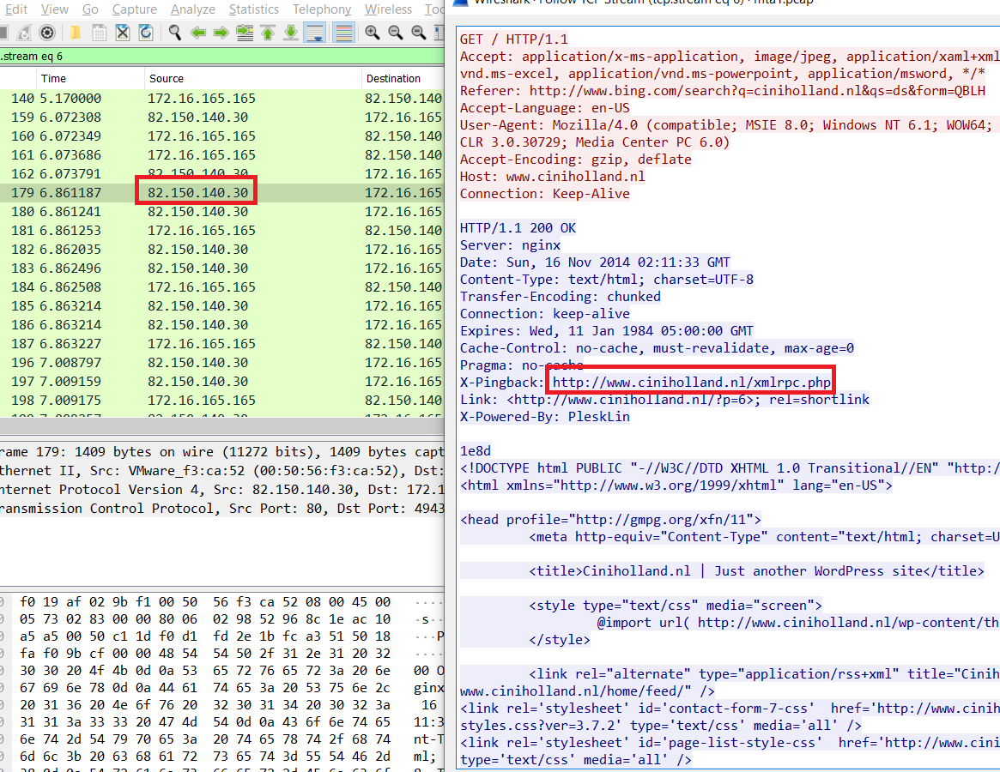
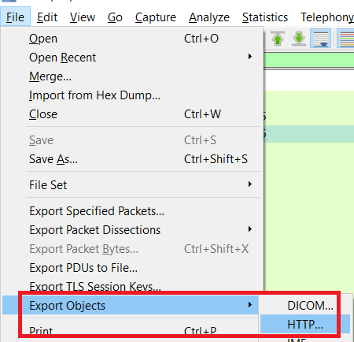
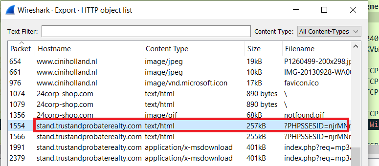
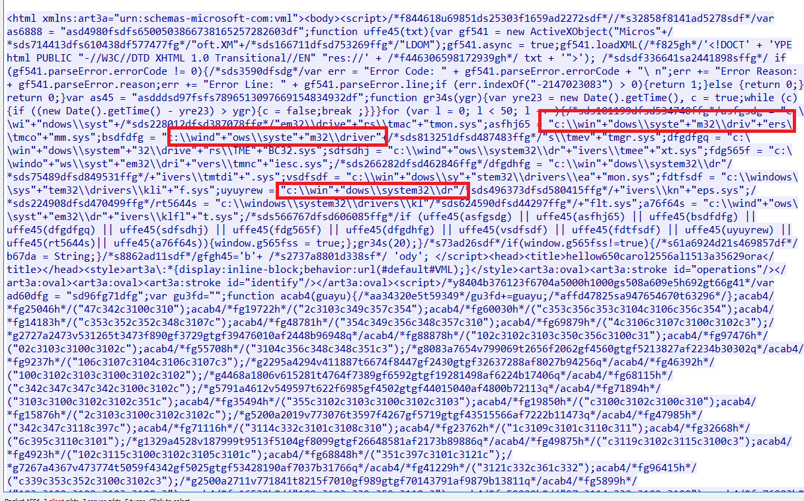
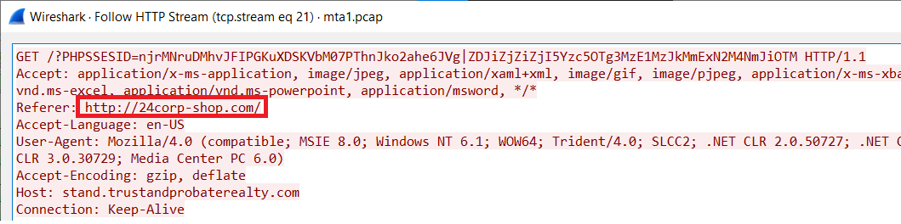
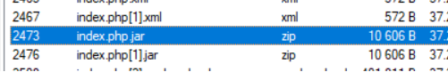
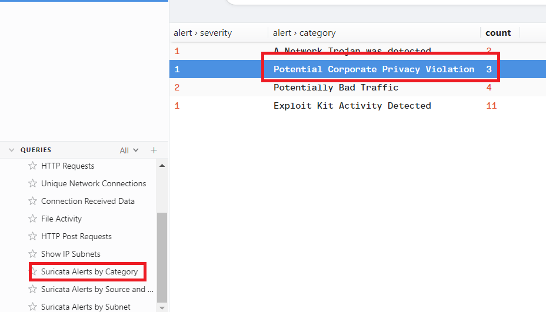
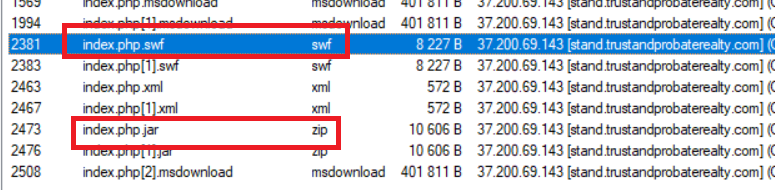
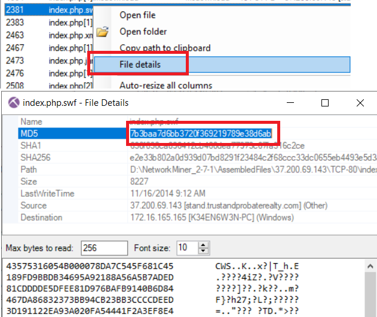

# Malware Traffic Analysis 1

+ ## Table of Contents
    - [Q1. What is the IP address of the Windows VM that gets infected?](#q1-what-is-the-ip-address-of-the-windows-vm-that-gets-infected)
    - [Q2. What is the hostname of the Windows VM that gets infected?](#q2-what-is-the-hostname-of-the-windows-vm-that-gets-infected)
    - [Q3. What is the MAC address of the infected VM?](#q3-what-is-the-mac-address-of-the-infected-vm)
    - [Q4. What is the IP address of the compromised web site?](#q4-what-is-the-ip-address-of-the-compromised-web-site)
    - [Q5. What is the FQDN of the compromised website?](#q5-what-is-the-fqdn-of-the-compromised-website)
    - [Q6. What is the IP address of the server that delivered the exploit kit and malware?](#q6-what-is-the-ip-address-of-the-server-that-delivered-the-exploit-kit-and-malware)
    - [Q7. What is the FQDN that delivered the exploit kit and malware?](#q7-what-is-the-fqdn-that-delivered-the-exploit-kit-and-malware)
    - [Q8. What is the redirect URL that points to the exploit kit (EK) landing page?](#q8-what-is-the-redirect-url-that-points-to-the-exploit-kit--ek--landing-page)
    - [Q9. Other than CVE-2013-2551 IE exploit, another application was targeted by the EK and starts with "J". Provide the full application name.](#q9-other-than-cve-2013-2551-ie-exploit--another-application-was-targeted-by-the-ek-and-starts-with-j-provide-the-full-application-name)
    - [Q10. How many times was the payload delivered?](#q10-how-many-times-was-the-payload-delivered)
    - [Q12. The compromised website has a malicious script with a URL. What is this URL?](#q12-the-compromised-website-has-a-malicious-script-with-a-url-what-is-this-url)
    - [Q13. Extract the two exploit files. What are the MD5 file hashes? (comma-separated )](#q13-extract-the-two-exploit-files-what-are-the-md5-file-hashes-comma-separated-)

### Q1. What is the IP address of the Windows VM that gets infected?
Extract attached file, opne with [Wireshark](https://www.wireshark.org/) 
We can see that only this private IP connects to the Internet. 
 
**Answer:** 172.16.165.165

### Q2. What is the hostname of the Windows VM that gets infected?
Reference: [Wireshark Identifying Hosts and Users](https://unit42.paloaltonetworks.com/using-wireshark-identifying-hosts-and-users/) 
Filter `bootp`, then choose DHCP Request 

 Expand DHCP Request, then click Option Host Name we will see Host Name of the Windows VM 
 
**Answer:** K34EN6W3N-PC 

### Q3. What is the MAC address of the infected VM?
Similarly, we will choose Option Client Identifier, the MAC will appear 
 
**Answer:**  f0:19:af:02:9b:f1

### Q4. What is the IP address of the compromised web site?
At line 179, we see some communication between Windows VM and a strange IP 
 
**Answer:** 82.150.140.30

### Q5. What is the FQDN of the compromised website?
We have already seen on Q4. 
**Answer:** ciniholland.nl

### Q6. What is the IP address of the server that delivered the exploit kit and malware?
Select File -> Export Object -> HTTP  
 
At packet 1554, we see a hostname use PHPSSESID as a parameter, looks like it's doing something. 
 
View Details of packet 1554, I saw something look like Windows's path. 
 
**Answer:** 37.200.69.143

### Q7. What is the FQDN that delivered the exploit kit and malware?
Based on Q6. 
**Answer:** stand.trustandprobaterealty.com

### Q8. What is the redirect URL that points to the exploit kit (EK) landing page?
Also in packet 1554, base on Referrer field. 
 
**Answer:** http://24corp-shop.com/

### Q9. Other than CVE-2013-2551 IE exploit, another application was targeted by the EK and starts with "J". Provide the full application name.
Use [NetworkMiner](https://www.netresec.com/?page=NetworkMiner) to load pcap file, at tab Files, we see some file with .jar and .swf extension downloaded. 
 
**Answer:** JAVA

### Q10. How many times was the payload delivered?
Use [Brim Security](https://www.brimdata.io/) to load the file, in Query select Suricata Alerts by Category, we see that Suricata is alert three times about Privacy Violation, it means that Windows VM has accessed to the malicious site. 
 
**Answer:** 3

### Q12. The compromised website has a malicious script with a URL. What is this URL?
We know the URL we are going to end up at is http://24corp-shop.com from earlier. 
**Answer:** http://24corp-shop.com/

### Q13. Extract the two exploit files. What are the MD5 file hashes? (comma-separated )
Use NetworkMiner, two files are with .jar and .swf 
 
You can right click and calculate MD5 hash for them. 
 
**Answer:** 7b3baa7d6bb3720f369219789e38d6ab,1e34fdebbf655cebea78b45e43520ddf