# Malware Traffic Analysis 2

+ ## Table of Contents
    - [Q1. What is the IP address of the Windows VM that gets infected?](#q1-what-is-the-ip-address-of-the-windows-vm-that-gets-infected)
    - [Q2. What is the MAC address of the infected VM?](#q2-what-is-the-mac-address-of-the-infected-vm)
    - [Q3. What are the IP address and port number that delivered the exploit kit and malware?](#q3-what-are-the-ip-address-and-port-number-that-delivered-the-exploit-kit-and-malware)
    - [Q4. What are the two FQDN's that delivered the exploit kit? comma-separated in alphabetical order.](#q4-what-are-the-two-fqdns-that-delivered-the-exploit-kit-comma-separated-in-alphabetical-order)
    - [Q5. What is the IP address of the compromised web site?](#q5-what-is-the-ip-address-of-the-compromised-web-site)
    - [Q6. What is the FQDN of the compromised website?](#q6-what-is-the-fqdn-of-the-compromised-website)
    - [Q7. What is the name exploit kit (EK) that delivered the malware? (two words)](#q7-what-is-the-name-exploit-kit-ek-that-delivered-the-malware-two-words)
    - [Q8. What is the redirect URL that points to the exploit kit landing page?](#q8-what-is-the-redirect-url-that-points-to-the-exploit-kit-landing-page)
    - [Q9. What is the IP address of the redirect URL that points to the exploit kit landing page?](#q9-what-is-the-ip-address-of-the-redirect-url-that-points-to-the-exploit-kit-landing-page)
    - [Q10. Extract the malware payload (PE file) from the PCAP. What is the MD5 hash?](#q10-extract-the-malware-payload-pe-file-from-the-pcap-what-is-the-md5-hash)
    - [Q11. What is the CVE of the exploited vulnerability?](#q11-what-is-the-cve-of-the-exploited-vulnerability)
    - [Q12. What is the mime-type of the file that took the longest time (duration) to be analyzed using Zeek?](#q12-what-is-the-mime-type-of-the-file-that-took-the-longest-time-duration-to-be-analyzed-using-zeek)
    - [Q13. What was the referrer for the visited URI that returned the file "f.txt"?](#q13-what-was-the-referrer-for-the-visited-uri-that-returned-the-file-ftxt)
    - [Q14. When was this PCAP captured?](#q14-when-was-this-pcap-captured)
    - [Q15. When was the PE file compiled?](#q15-when-was-the-pe-file-compiled)
    - [Q16. What is the name of the SSL certificate issuer that appeared only once? (one word)](#q16-what-is-the-name-of-the-ssl-certificate-issuer-that-appeared-only-once-one-word)
    - [Q17. What were the two protection methods enabled during the compilation of the present PE file? Format: comma-separated in alphabetical order](#q17-what-were-the-two-protection-methods-enabled-during-the-compilation-of-the-present-pe-file-format-comma-separated-in-alphabetical-order)

### Q1. What is the IP address of the Windows VM that gets infected?
Use [Brim Security](https://www.brimdata.io/) to load attached file. Then choose Queries => HTTP Requests, we will see the Windows VM's IP make requests.<br/>
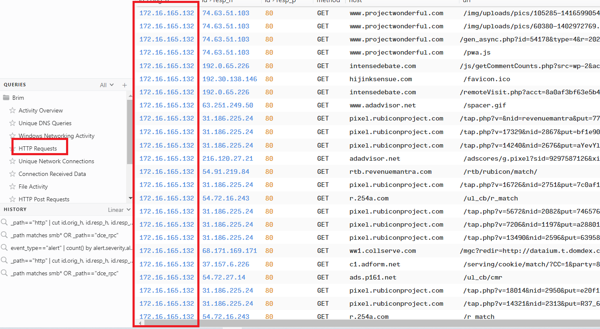<br/>
**Answer:** 172.16.165.132

### Q2. What is the MAC address of the infected VM?
Open with WireShark, then choose a packet with Windows VM's IP, we'll see the MAC address in the middle panel.<br/>
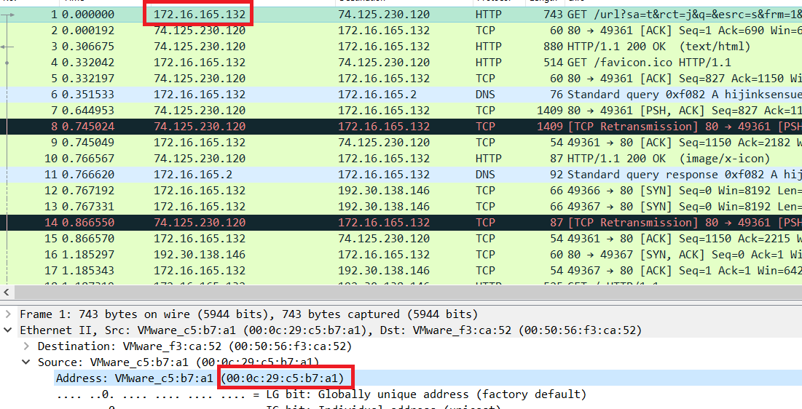<br/>
**Answer:** 00:0c:29:c5:b7:a1

### Q3. What are the IP address and port number that delivered the exploit kit and malware?
Search `files application` in Brim, we'll see in mime_type column there are type x-dosexec, these types of files are executable or malicious.<br/>
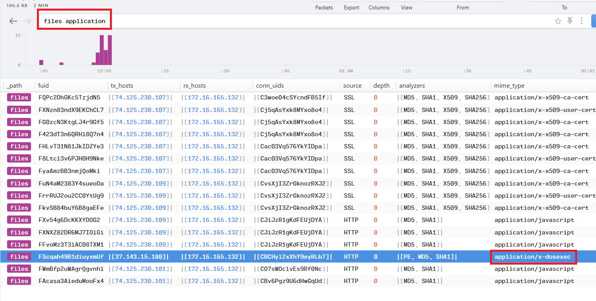<br/>
Use Wireshark and filter ip.src==37.143.15.180, we see all source port are 51439.<br/>
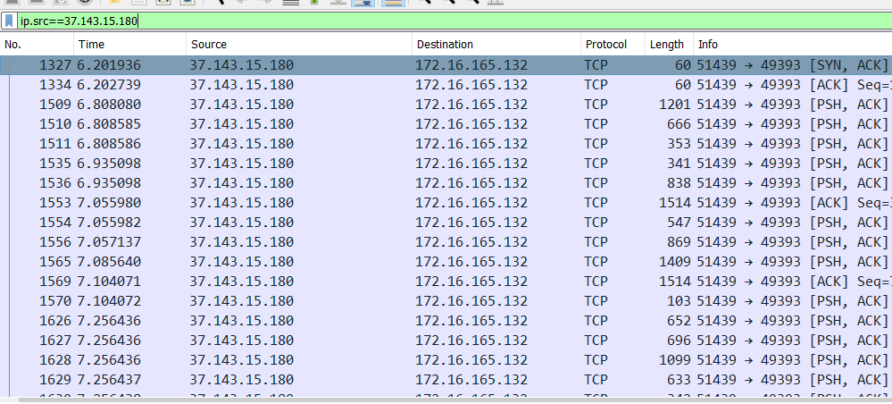<br/>
**Answer:** 37.143.15.180:51439

### Q4. What are the two FQDN's that delivered the exploit kit? comma-separated in alphabetical order.
Unique DNS queries in Brim, we'll see two suspicious domains.<br/>
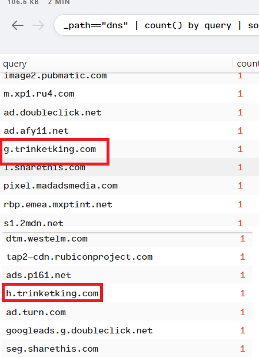<br/>
**Answer:** g.trinketking.com,h.trinketking.com

### Q5. What is the IP address of the compromised web site?
In Wireshark, select tab Statistics -> Conversations -> IPv4. We notice that the conversations between Windows VM and 192.30.138.146 has the largest number of packets.<br/>
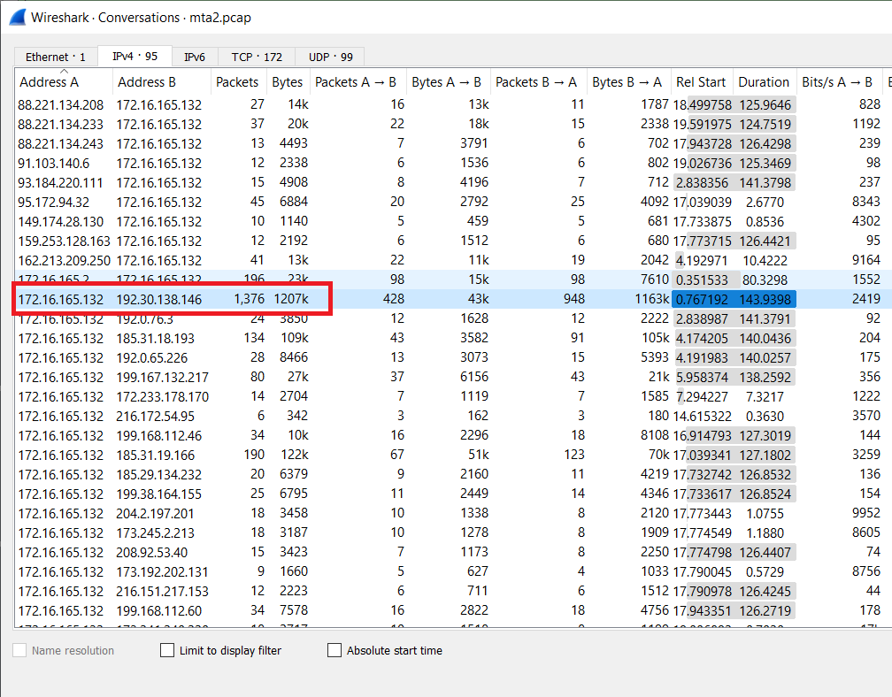<br/>
**Answer:** 192.30.138.146

### Q6. What is the FQDN of the compromised website?
Use Brim, fileter ip.resp_h==192.30.138.146<br/>
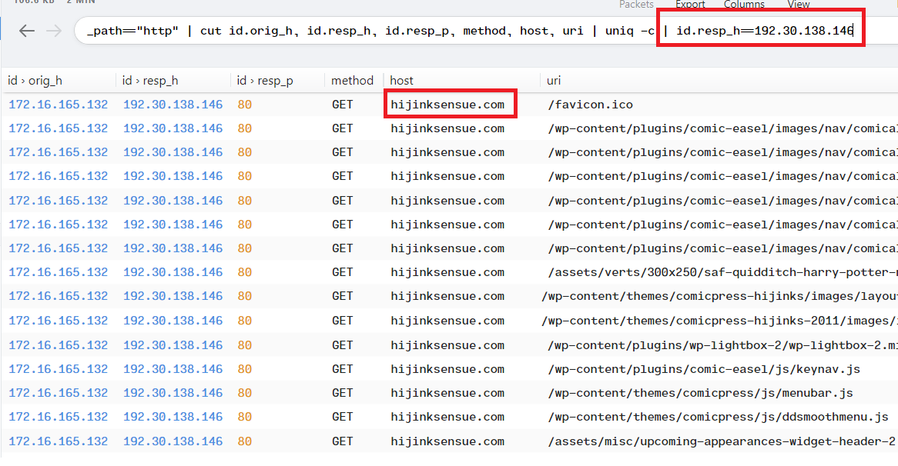<br/>
**Answer:** hijinksensue.com

### Q7. What is the name exploit kit (EK) that delivered the malware? (two words)
Upload this file to [PacketTotal](https://packettotal.com/), then you will see the alert.signature about Network Trojan with its name.<br/>
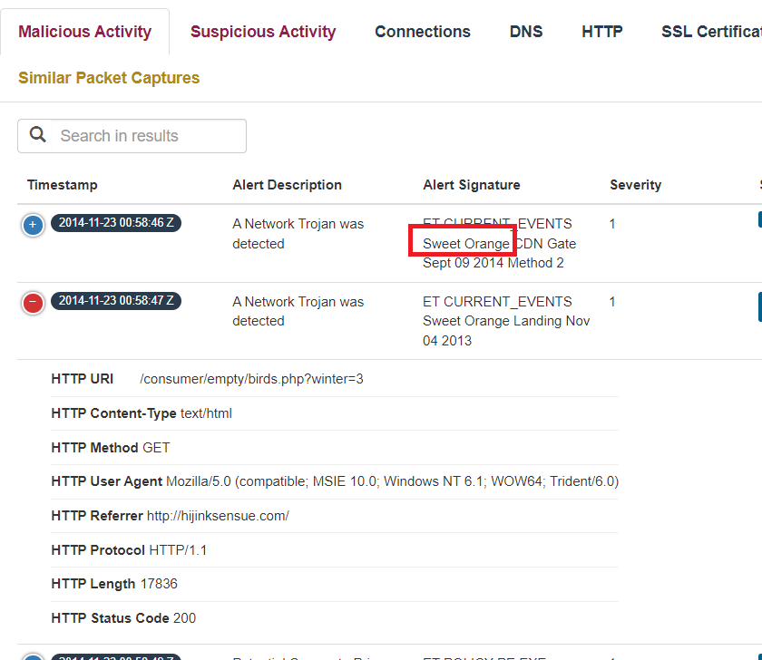<br/>
**Answer:** Sweet Orange

### Q8. What is the redirect URL that points to the exploit kit landing page?
Also here, we can see Windows VM send request almost at the same time.<br/>
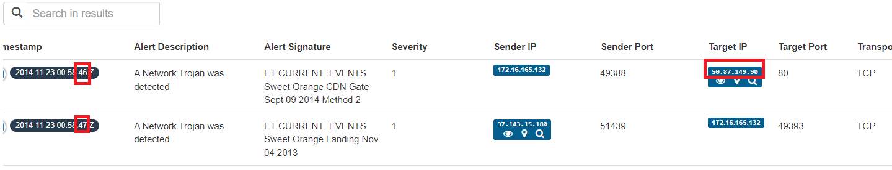<br/>
In Wireshark, filter ip.dst==50.87.149.90, we will see full URL and URI,<br/>
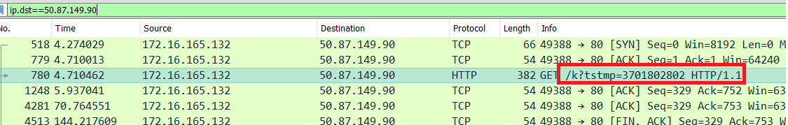<br/>
**Answer:** 

### Q9. What is the IP address of the redirect URL that points to the exploit kit landing page?
In Q8, we have had the answer.<br/>
**Answer:** 

### Q10. Extract the malware payload (PE file) from the PCAP. What is the MD5 hash?
In Wireshark, File -> Export Objects -> HTTP, select packet as below image.<br/>
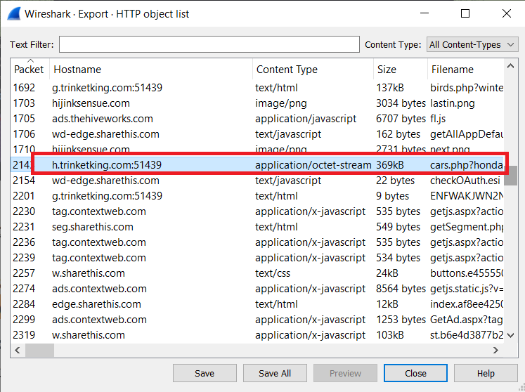<br/>
Extract this file, to ensure it's a malware, use `file` command to check it, and then calculate its md5 hash.<br/>
```powershell
➜ file .\malware
.\malware: PE32 executable (GUI) Intel 80386 (stripped to external PDB), for MS Windows
➜ md5sum.exe .\malware
\1408275c2e2c8fe5e83227ba371ac6b3 *.\\malware
```
**Answer:** 1408275c2e2c8fe5e83227ba371ac6b3

### Q11. What is the CVE of the exploited vulnerability?
Using Google earch Engine with keywork is "Sweet Orange CVE", we'll see the answer.<br/>
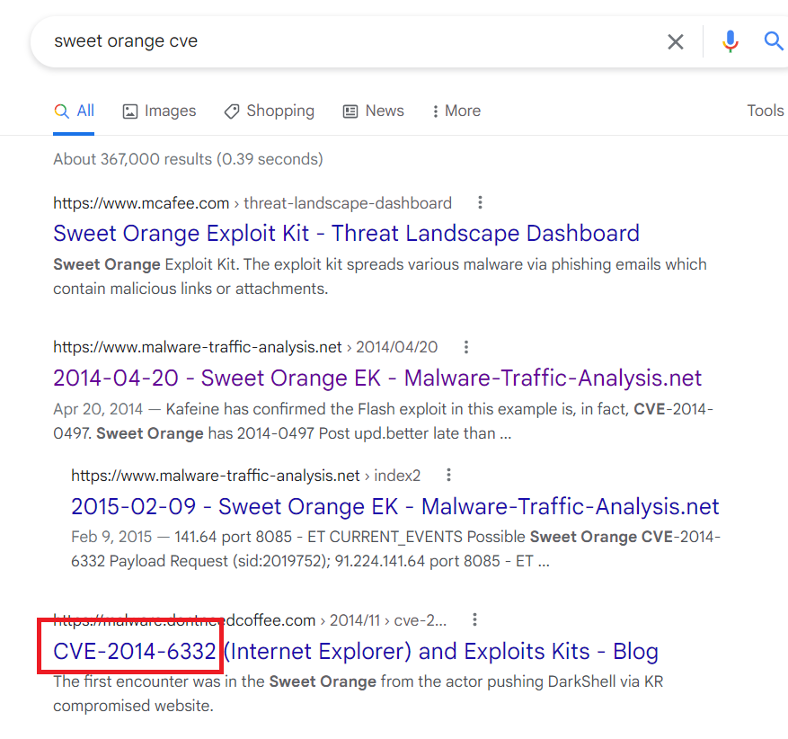<br/>
**Answer:** CVE-2014-6332

### Q12. What is the mime-type of the file that took the longest time (duration) to be analyzed using Zeek?
In Brim, filter "files application", then sort by time descending.<br/>
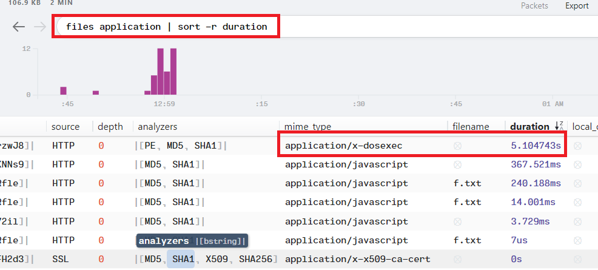
**Answer:** 

### Q13. What was the referrer for the visited URI that returned the file "f.txt"?
In Wireshark, at packet 2383, we found this request contains "f.txt", based on the Referrer field, we have the answer.<br/>
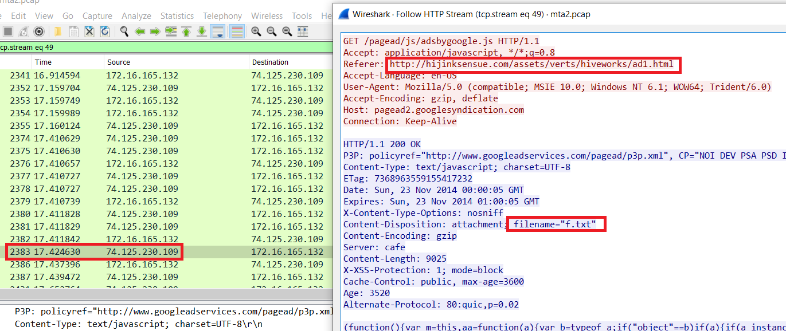<br/>
**Answer:** http://hijinksensue.com/assets/verts/hiveworks/ad1.html

### Q14. When was this PCAP captured?
Select info Pcap, the answer is displayed.<br/>
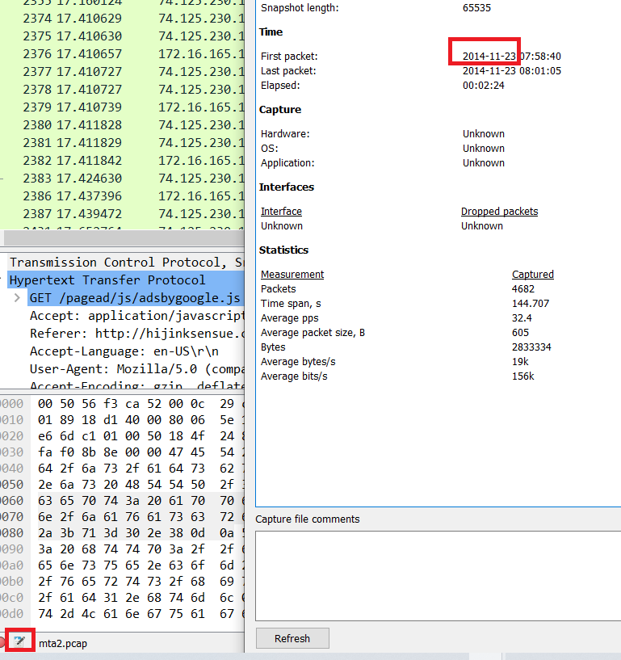<br/>
**Answer:** 

### Q15. When was the PE file compiled?
Upload the malicious file extracting from Q10 to [VirusTotal](https://www.virustotal.com/gui/file/cc185105946c202d9fd0ef18423b078cd8e064b1e2a87e93ed1b3d4f2cbdb65d/details), at Portable Executable Info field, in Header section, the Compilation TimeStamp is showed.<br/>
**Answer:** 21/11/2014

### Q16. What is the name of the SSL certificate issuer that appeared only once? (one word)
In Brim, filter _path=="ssl", at Issuer column, we see "Cybertrust" appeared only once.<br/>
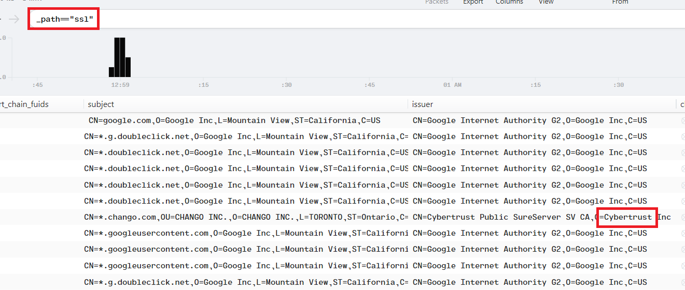<br/>
**Anser:** Cybertrust

### Q17. What were the two protection methods enabled during the compilation of the present PE file? Format: comma-separated in alphabetical order
Referrer: https://github.com/Wenzel/checksec.py/releases/tag/v0.6.2<br/>
It's also `checksec` command in Linux, but there is for Windows. Use this, we will see all protection methods are enabled.<br/>
```powershell
checksec.exe ./malware
```
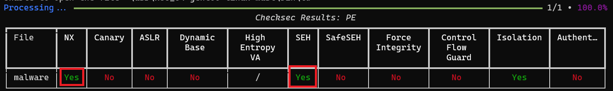<br/>
In Windows, NX is DEP (Data Execution Prevention), SEH (Structured Exception Handling), so we have the answer.<br/>
**Answer:** DEP,SEH
