# Malware Traffic Analysis 3

- ## Summary
    * [Q1. What is the IP address of the infected Windows host?](#q1-what-is-the-ip-address-of-the-infected-windows-host)
    * [Q2. What is the Exploit kit (EK) name? (two words)](#q2-what-is-the-exploit-kit-ek-name-two-words)
    * [Q3. What is the FQDN that delivered the exploit kit?](#q3-what-is-the-fqdn-that-delivered-the-exploit-kit)
    * [Q4. What is the redirect URL that points to the exploit kit landing page?](#q4-what-is-the-redirect-url-that-points-to-the-exploit-kit-landing-page)
    * [Q5. What is the FQDN of the compromised website?](#q5-what-is-the-fqdn-of-the-compromised-website)
    * [Q6. Which TCP stream shows the malware payload being delivered? Provide stream number](#q6-which-tcp-stream-shows-the-malware-payload-being-delivered-provide-stream-number)
    * [Q7. What is the IP address of the C&amp;C server?](#q7-what-is-the-ip-address-of-the-cc-server)
    * [Q8. What is the expiration date of the SSL certificate?](#q8-what-is-the-expiration-date-of-the-ssl-certificate)
    * [Q10. The malicious domain served a ZIP archive. What is the name of the DLL file included in this archive?](#q10-the-malicious-domain-served-a-zip-archive-what-is-the-name-of-the-dll-file-included-in-this-archive)
    * [Q11. Extract the malware payload, deobfuscate it, and remove the shellcode at the beginning. This should give you the actual payload (a DLL file) used for the infection. What's the MD5 hash of the payload?](#q11-extract-the-malware-payload-deobfuscate-it-and-remove-the-shellcode-at-the-beginning-this-should-give-you-the-actual-payload-a-dll-file-used-for-the-infection-whats-the-md5-hash-of-the-payload)
    * [Q12. What were the two protection methods enabled during the compilation of the PE file? (comma-separated)](#q12-what-were-the-two-protection-methods-enabled-during-the-compilation-of-the-pe-file-comma-separated)
    * [Q13. When was the DLL file compiled?](#q13-when-was-the-dll-file-compiled)
    * [Q14. A Flash file was used in conjunction with the redirect URL. What URL was used to retrieve this flash file?](#q14-a-flash-file-was-used-in-conjunction-with-the-redirect-url-what-url-was-used-to-retrieve-this-flash-file)
    * [Q15. What is the CVE of the exploited vulnerability?](#q15-what-is-the-cve-of-the-exploited-vulnerability)
    * [Q16. What was the web browser version used by the infected host?](#q16-what-was-the-web-browser-version-used-by-the-infected-host)
    * [Q17. What is the DNS query that had the highest RTT?](#q17-what-is-the-dns-query-that-had-the-highest-rtt)
    * [Q18. What the name of the SSL certificate issuer that appeared the most? (one word)](#q18-what-the-name-of-the-ssl-certificate-issuer-that-appeared-the-most-one-word)

### Q1. What is the IP address of the infected Windows host?
Similarly, load attached file with Brim, you'll see Windows VM's IP.<br/>
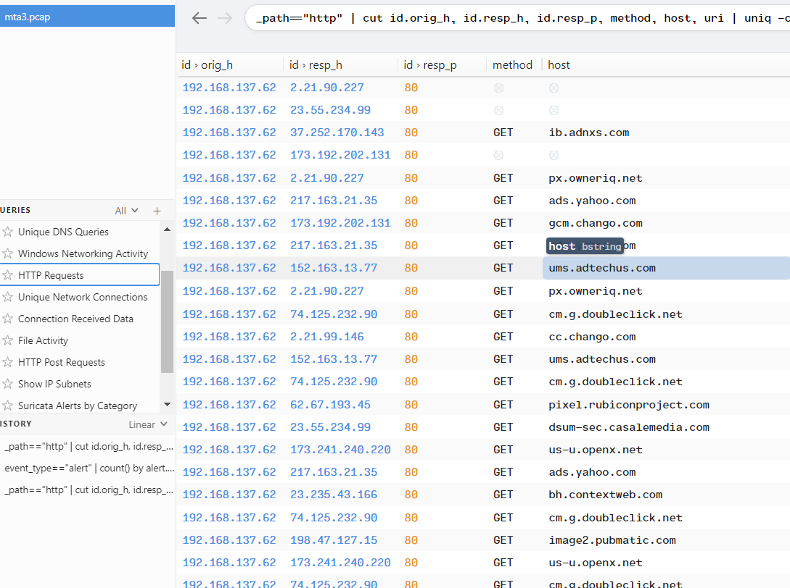<br/>
**Answer:** 192.168.137.62

### Q2. What is the Exploit kit (EK) name? (two words)
Upload to [PacketTotal](https://packettotal.com/), observe in alert signature.<br/>
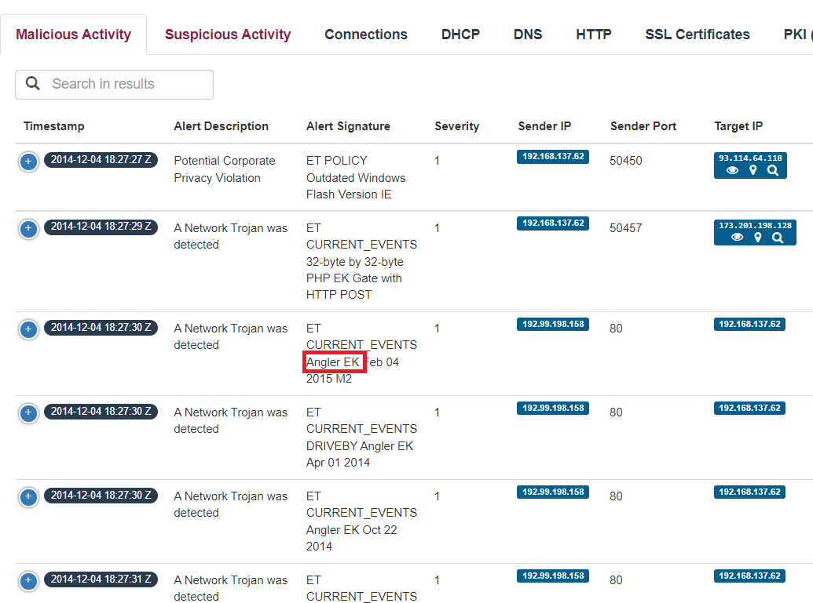<br/>
**Answer:** Angler EK

### Q3. What is the FQDN that delivered the exploit kit?
In Brim, filter with IP in Q2, we'll see the FQDN.<br/>
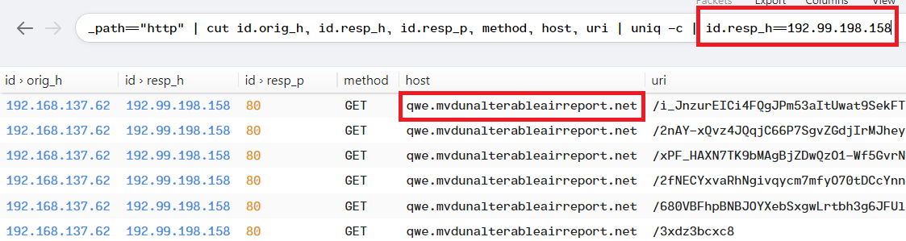<br/>
**Answer:** qwe.mvdunalterableairreport.net

### Q4. What is the redirect URL that points to the exploit kit landing page?
We notice to this thread.<br/>
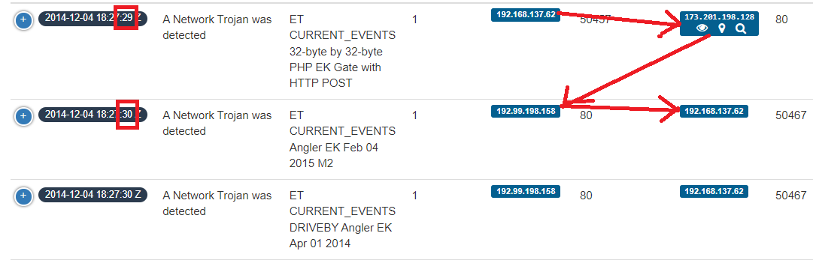
Back to Brim, filter this IP.<br/>
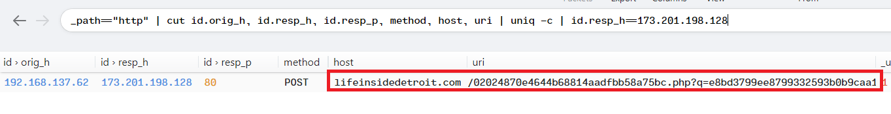<br/>
**Answer:** http://lifeinsidedetroit.com/02024870e4644b68814aadfbb58a75bc.php?q=e8bd3799ee8799332593b0b9caa1f426

### Q5. What is the FQDN of the compromised website?
In Wireshark, filter "http && ip.src==192.168.137.62", then Follow TCP Stream.<br/>
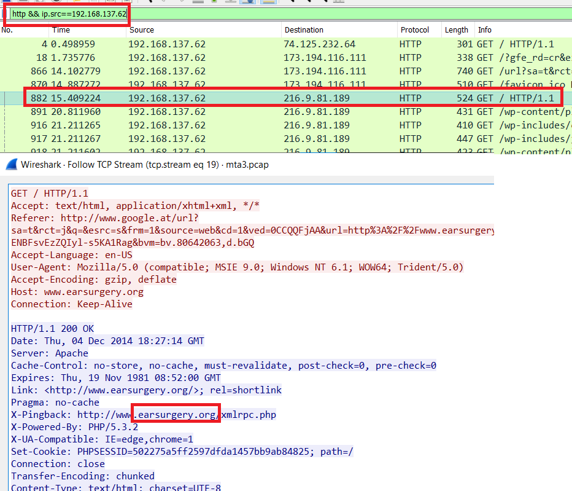<br/>
**Answer:** earsurgery.org

### Q6. Which TCP stream shows the malware payload being delivered? Provide stream number
In Wireshark, export HTTP objects, we found a packet with Content Type is application/octet-stream.<br/>
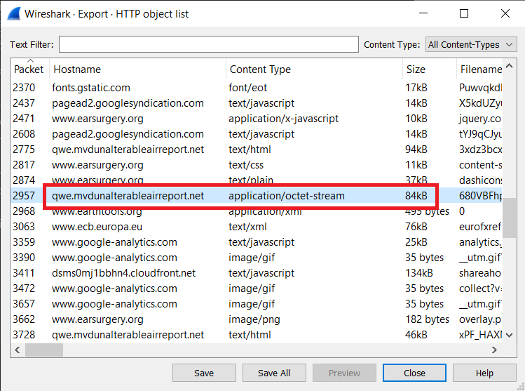<br/>
Follow TCP Stream, it's 80th.<br/>
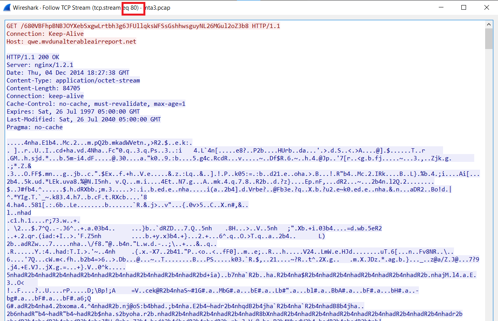<br/>
**Answer:** 80

### Q7. What is the IP address of the C&C server?
In PacketTotal, I found a strange IP with SSL Cert connect to Windows VM.<br/>
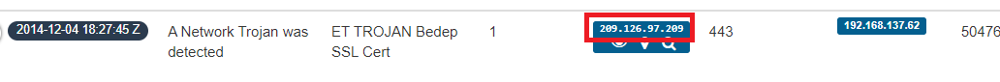<br/>
**Answer:** 209.126.97.209

### Q8. What is the expiration date of the SSL certificate?
Filter C&C Server's IP, we will see the packet with TLS Certificate.<br/>
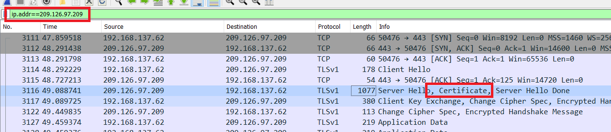<br/>
Follow this PATH: Transport Layer Security -> TLSv1 Record Layer: Certificate -> Handshake Protocol -> Certificates -> Certificate: 3082... -> signedCertificate -> validity -> notAfter.<br/>
You'll see the expriration date of that Cert.<br/>
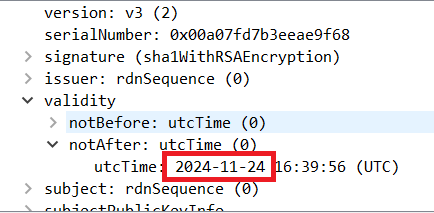<br/>
**Answer:** 24/11/2024

### Q10. The malicious domain served a ZIP archive. What is the name of the DLL file included in this archive?
In Packettotal, select tab Transfer file, filter with "zip".<br/>
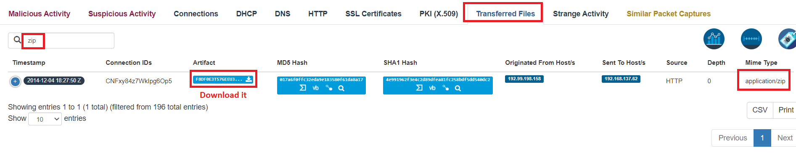<br/>
Ensure this's really a ZIP file.<br/>
```powershell
➜ file.exe .\extract-1417717670.13542-HTTP-F8df0E3t57GEEu3nB2
.\extract-1417717670.13542-HTTP-F8df0E3t57GEEu3nB2: Zip archive data, at least v2.0 to extract
```
Change its extension, then open.
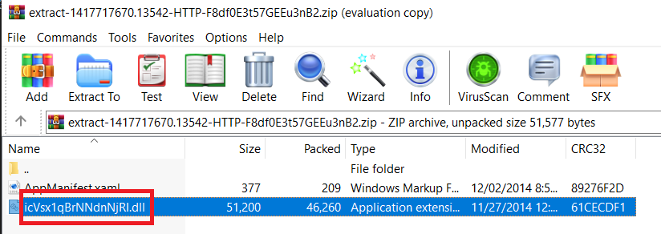<br/>
**Answer:** icVsx1qBrNNdnNjRI.dll

### Q11. Extract the malware payload, deobfuscate it, and remove the shellcode at the beginning. This should give you the actual payload (a DLL file) used for the infection. What's the MD5 hash of the payload?
Extract payload from TCP Stream in Q6, then use `strings` to this file. We'll see a string repeate many times.<br/>
```powershell
strings 680VBFhpBNBJOYXebSxgwLrtbh3g6JFUllqksWFSsGshhwsguyNL26MGul2oZ3b8
```
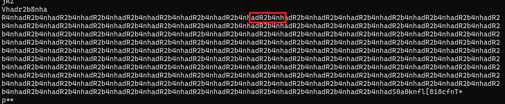<br/>
After researching, I found that Angler EK use XOR algorithm to obfuscate the payload, therefore, we only need to XOR this payload again to retrive original payload. The key is adR2b4nh<br/>
Use [CyberChef](https://gchq.github.io/CyberChef/) to deobfuscate the payload, download output as file.<br/>
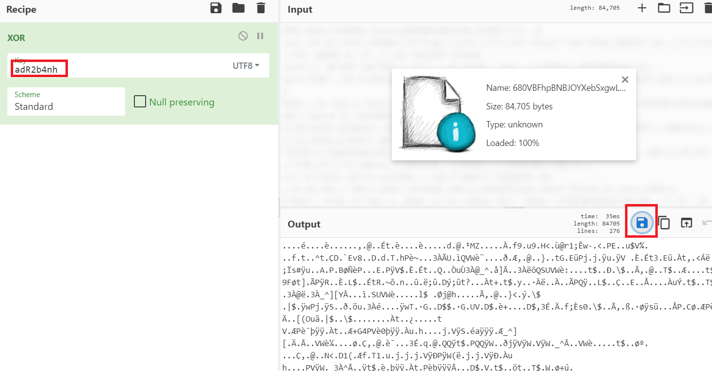<br/>
Check file type, but it's just data.
```powershell
➜ file .\deobfuscate
.\deobfuscate: data
```
`strings` it.<br/>
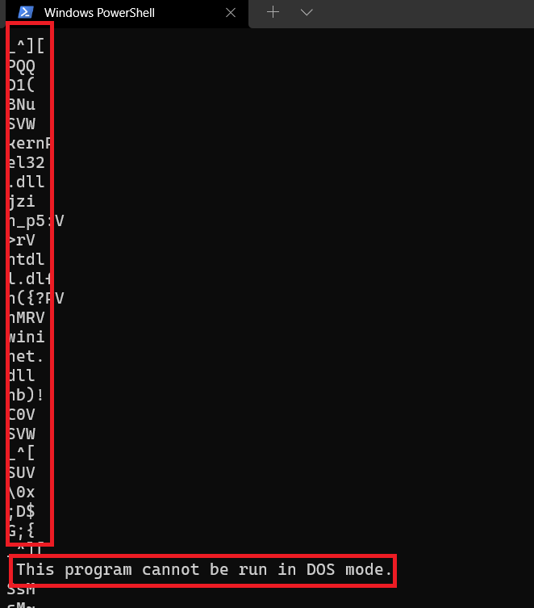<br/>
We see some thing before `This program cannot be run in DOS mode.`, we must remove them first.<br/>
Open with [HxD](https://mh-nexus.de/en/downloads.php?product=HxD20)<br/>
Research for hex header of PE file, that is "4D 5A".<br/>
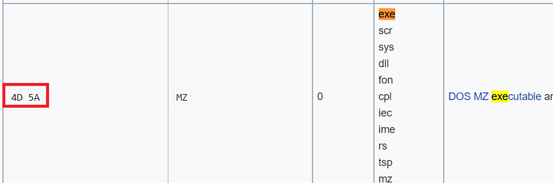<br/>
In HxD, it's at offset 591.<br/>
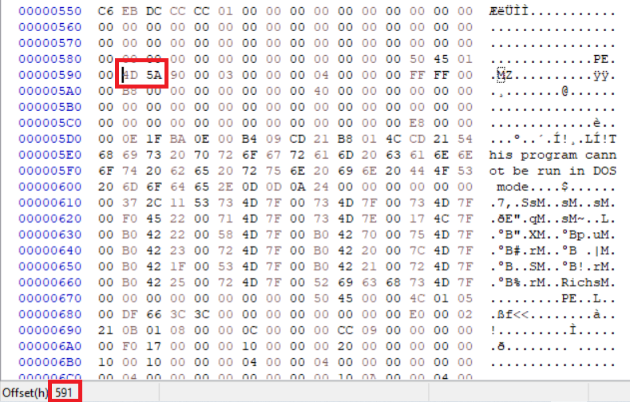<br/>
So, we need to delete all byte from 0 to 590.<br/>
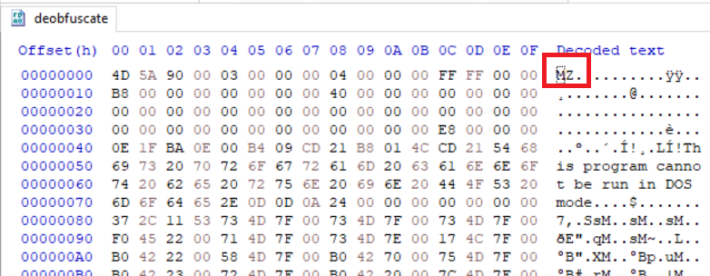<br/>
Then we check file type again, now it's a PE file, and md5 hash.
```powershell
➜ file.exe .\deobfuscate
.\deobfuscate: PE32 executable (DLL) (GUI) Intel 80386, for MS Windows
➜ md5sum.exe .\deobfuscate
\3dfa337e5b3bdb9c2775503bd7539b1c *.\\deobfuscate
```
**Answer:** 3dfa337e5b3bdb9c2775503bd7539b1c

### Q12. What were the two protection methods enabled during the compilation of the PE file? (comma-separated)
Just use `checksec` command, the result:<br/>
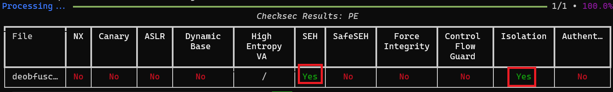<br/>
SEH, Isolation also known as Canary
**Answer:** SEH,Canary

### Q13. When was the DLL file compiled?
Use VirusTotal, paste MD5 from Q11, in Portable Executable Info we'll see the compilation timestamp.<br/>
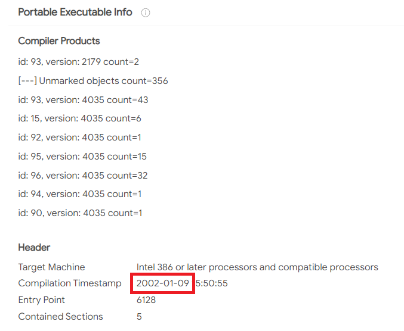<br/>
**Answer:** 09/01/2002

### Q14. A Flash file was used in conjunction with the redirect URL. What URL was used to retrieve this flash file?
The Flash file will end with .swf, use NetworkMiner at packet 1829.<br/>
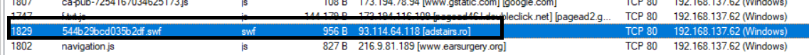<br/>
Move to Wireshark, follow HTTP Stream of packet 1829.
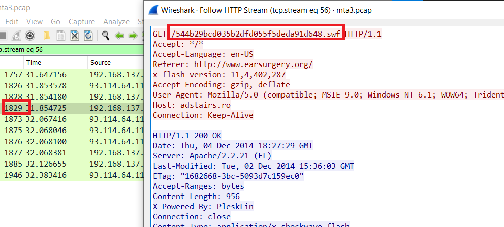<br/>
**Answer:** http://adstairs.ro/544b29bcd035b2dfd055f5deda91d648.swf

### Q15. What is the CVE of the exploited vulnerability?
Use Google, we will see the CVE.<br/>
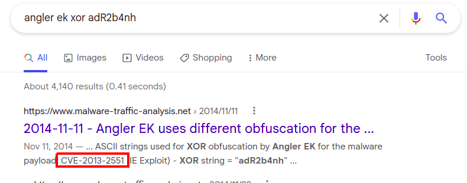<br/>
**Answer:** CVE-2013-2551

### Q16. What was the web browser version used by the infected host?
From Q14, the version of Internet Explorer is 9.0.<br/>
**Answer:** 9

### Q17. What is the DNS query that had the highest RTT?
In Brim, filter _path=="dns" | sort -r rtt, you'll see the DNS with highest RTT.<br/>
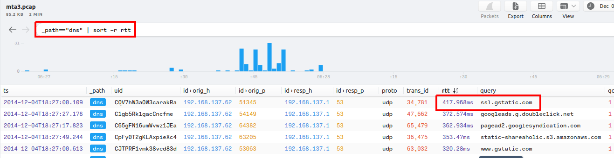<br/>
**Answer:** ssl.gstatic.com

### Q18. What the name of the SSL certificate issuer that appeared the most? (one word)
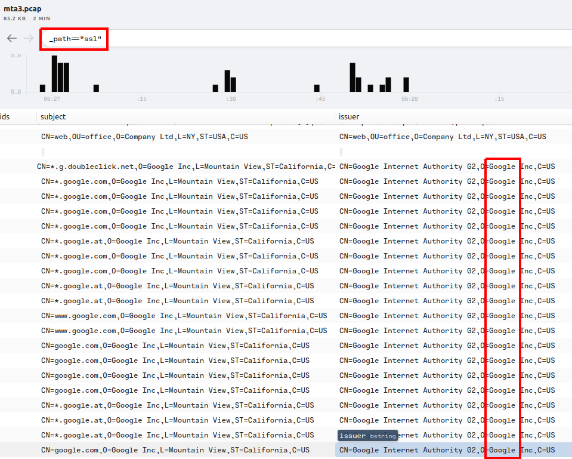<br/>
**Answer:** Google