# Malware Tracffic Analysis 4

- ## Summary
    - [Q1. What is the victim IP address?](#q1-what-is-the-victim-ip-address)
    - [Q2. What is the victim's hostname?](#q2-what-is-the-victims-hostname)
    - [Q3. What is the exploit kit name?](#q3-what-is-the-exploit-kit-name)
    - [Q4. What is the IP address that served the exploit?](#q4-what-is-the-ip-address-that-served-the-exploit)
    - [Q5. What is the HTTP header that is used to indicate the flash version?](#q5-what-is-the-http-header-that-is-used-to-indicate-the-flash-version)
    - [Q6. What is the malicious URL that redirects to the server serving the exploit?](#q6-what-is-the-malicious-url-that-redirects-to-the-server-serving-the-exploit)
    - [Q7. What is The CAPEC ID corresponding to the technique used to redirect the victim to the exploit server? More info at capec.mitre.org](#q7-what-is-the-capec-id-corresponding-to-the-technique-used-to-redirect-the-victim-to-the-exploit-server-more-info-at-capecmitreorg)
    - [Q8. What is the FQDN of the compromised website?](#q8-what-is-the-fqdn-of-the-compromised-website)
    - [Q9. The compromised website contains a malicious js that redirect the user to another website. What is the variable name passed to the "document.write" function?](#q9-the-compromised-website-contains-a-malicious-js-that-redirect-the-user-to-another-website-what-is-the-variable-name-passed-to-the-documentwrite-function)
    - [Q10. What is the Compilation Timestamp of the malware found on the machine? Format: YYYY-MM-DD hh:mm:ss](#q10-what-is-the-compilation-timestamp-of-the-malware-found-on-the-machine-format-yyyy-mm-dd-hhmmss)

### Q1. What is the victim IP address?
Use Brim.<br/>
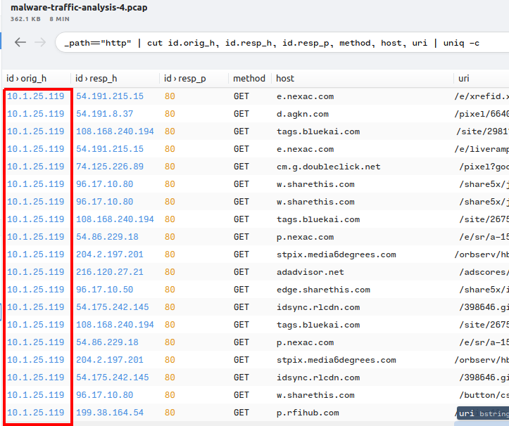<br/>
**Answer:** 10.1.25.119

### Q2. What is the victim's hostname?
Filter _path=="dhcp".<br/>
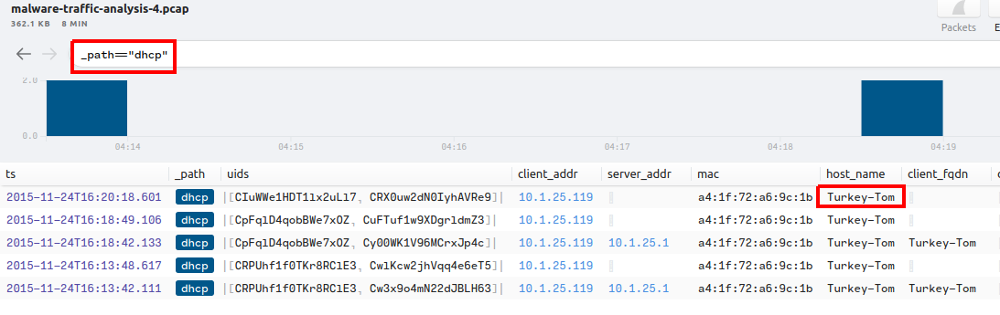<br/>
**Answer:** Turkey-Tom

### Q3. What is the exploit kit name?
In NetworkMiner, at packet 10960, it transfer a .swf file, extract and scan with ClamAV for checking the EK.<br/>
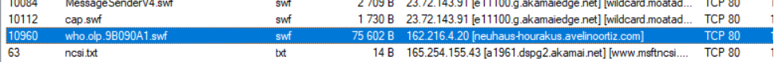<br/>
After checking with ClamAV.<br/>
```shell
lubuntu@lubuntu:~/Cyberdefenders.org$ clamscan who.olp.9B090A1.swf 
/home/lubuntu/Cyberdefenders.org/who.olp.9B090A1.swf: Swf.Malware.Angler-33 FOUND

----------- SCAN SUMMARY -----------
Known viruses: 8602364
Engine version: 0.103.2
Scanned directories: 0
Scanned files: 1
Infected files: 1
Data scanned: 0.07 MB
Data read: 0.07 MB (ratio 1.00:1)
Time: 22.752 sec (0 m 22 s)
Start Date: 2022:01:08 21:48:38
End Date:   2022:01:08 21:49:01
```
**Answer:** Angler

### Q4. What is the IP address that served the exploit?
From Q3.<br/>
**Answer:** 162.216.4.20

### Q5. What is the HTTP header that is used to indicate the flash version?
We just need to find the packet which sent the EK, it's packet 11089.<br/>
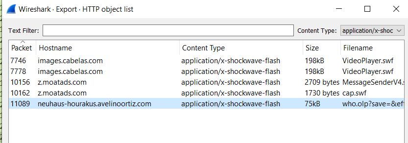<br/>
Follow TCP Strea, you'll see the field contain Flash's version.<br/>
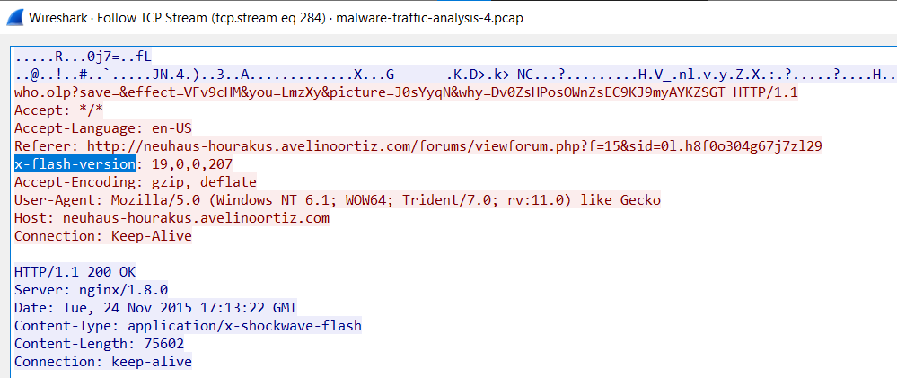<br/>
**Answer:** x-flash-version

### Q6. What is the malicious URL that redirects to the server serving the exploit?
At packer 10960, based on Referrer field.<br/>
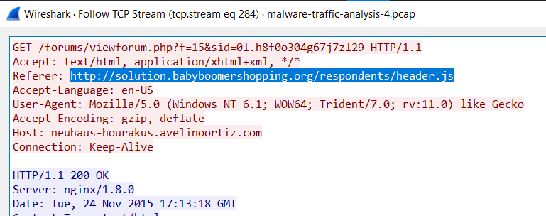<br/>
**Answer:** http://solution.babyboomershopping.org/respondents/header.js

### Q7. What is The CAPEC ID corresponding to the technique used to redirect the victim to the exploit server? More info at capec.mitre.org
From Q6, redirect URL is http://solution.babyboomershopping.org/respondents/header.js and its IP is 85.143.220.17., filter it.
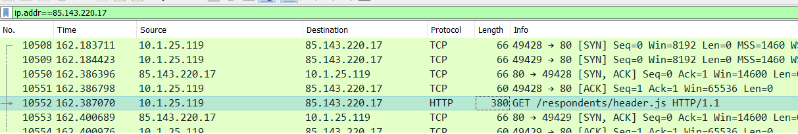<br/>
Follow TCP Stream, we'll see it use `<ifame>` to redirect victim. Now, use Google, we will see the result.<br/>
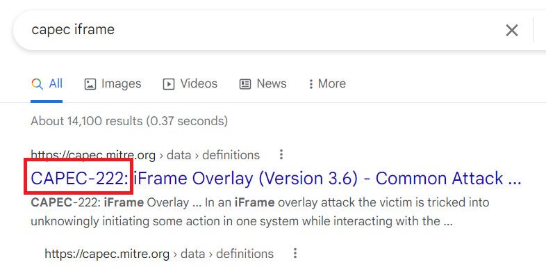<br/>
**Answer:** CAPEC-222

### Q8. What is the FQDN of the compromised website?
In Brim, filter _path=="http" host=="solution.babyboomershopping.org". Based on Referrer column.<br/>
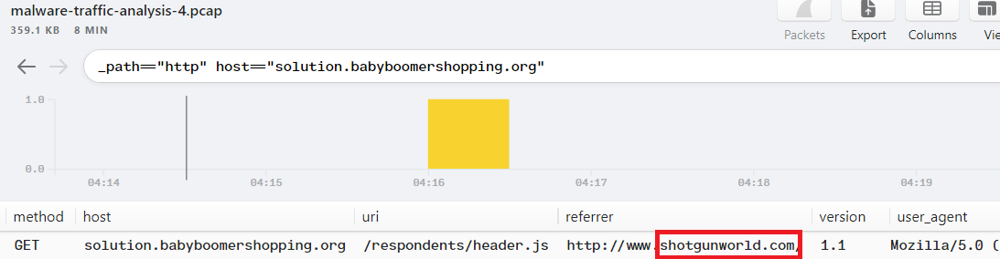<br/>
**Answer:** shotgunworld.com

### Q9. The compromised website contains a malicious js that redirect the user to another website. What is the variable name passed to the "document.write" function?
In NetworkMiner, packet 10323 contains a JS file, open it you'll see the document.write(OX_....).<br/>
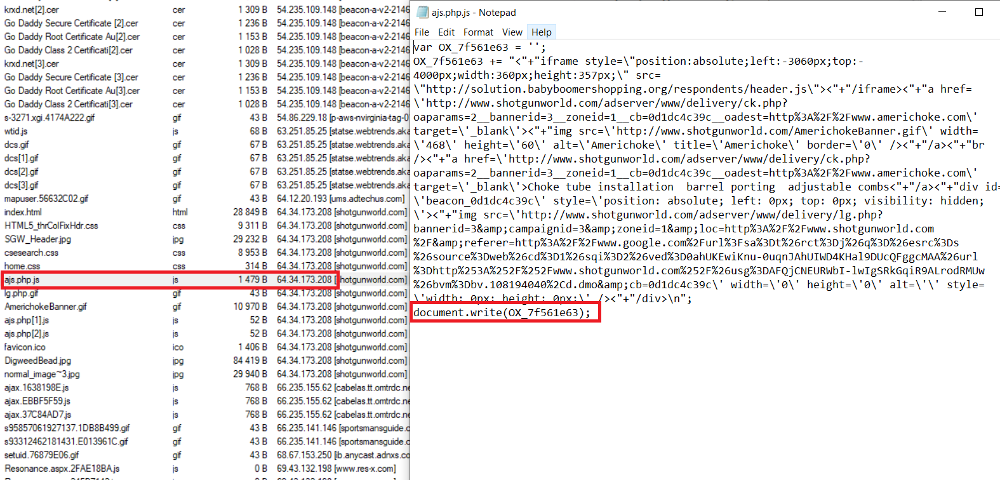<br/>
**Answer:** OX_7f561e63

### Q10. What is the Compilation Timestamp of the malware found on the machine? Format: YYYY-MM-DD hh:mm:ss
I've been stuck at here for a while because I cannot extract decrypted payload. When I did Google search I found this [link](https://resources.infosecinstitute.com/topic/threat-hunting-malware-angler-ek-analysis-security-onion-goofus-gallant/), which is the prototype of this lab. They give me the hash value of original payload (d16ad130daed5d4f3a7368ce73b87a8f84404873cbfc90cc77e967a83c947cd2). Submit it to VirusTotal, we will see the Compilation Timestamp.<br/>
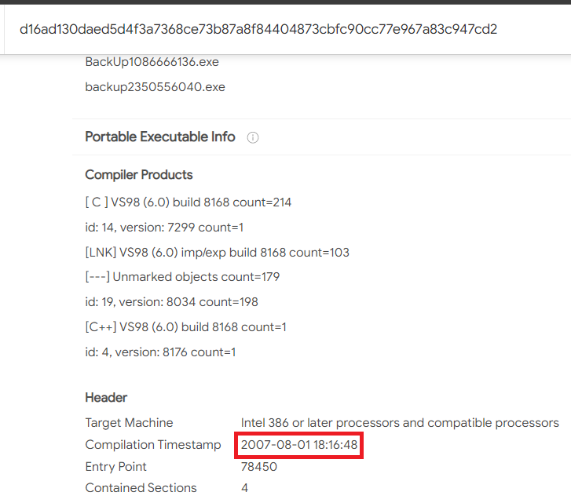<br/>
**Answer:** 2007-08-01 18:16:48