# PacketMaze - Cyberdefenders.org

## Summary

### Q1. What is the FTP password?
Open material with Wireshark, then filter FTP protocol and follow TCP Stream.<br>
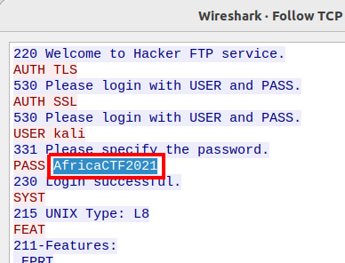<br>
**Answer:** AfricaCTF2021

### Q2. What is the IPv6 address of the DNS server used by 192.168.1.26? (####::####:####:####:####)
FIlter with `dns && ipv6`.<br>
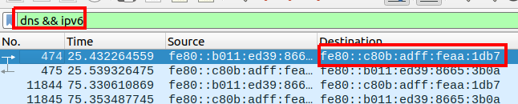<br>
**Answer:** fe80::c80b:adff:feaa:1db7

### Q3. What domain is the user looking up in packet 15174?
Use `Ctrl + G` shortcut to jump to packet 15174.<br>
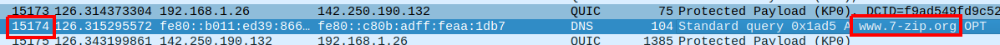<br>
**Answer:** www.7-zip.org

### Q4. How many UDP packets were sent from 192.168.1.26 to 24.39.217.246?
Filter with `udp && ip.src==192.168.1.26 && ip.dst==24.39.217.246` and based on Displayed at the right bottom.<br>
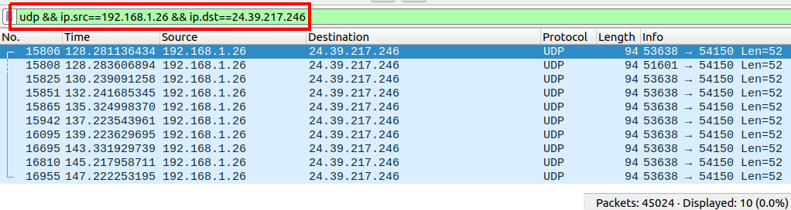<br>
**Answer:** 10

### Q5. What is the MAC address of the system being investigated in the PCAP?”
Select a random packet has IP 192.168.1.26. In Ethernet II, base on this IP is source or destination we will choose corresponding.<br>
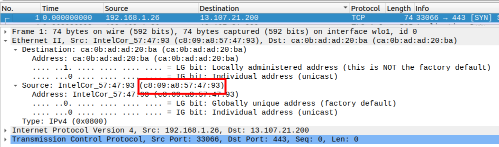<br>
**Answer:** c8:09:a8:57:47:93

### Q6. What was the camera model name used to take picture 20210429_152157.jpg?
First, I try Export Objects -> HTTP/TFTP/SMB but all of them are not find anything. But when go back to overview, I found protocol FTP-DATA performing transfer 20210429_152157.jpg. Right click and follow TCP stream, change show as to `Raw` hen `Save as` to 20210429_152157.jpg.<br>
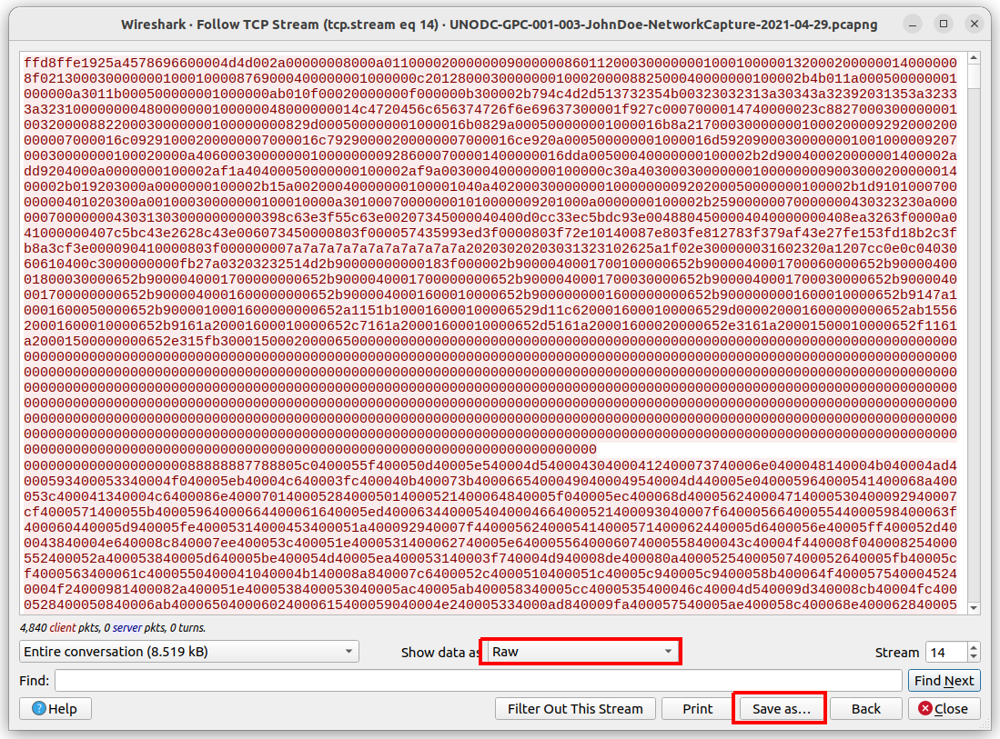<br>
The image that was transfer is shown below.<br>
<br>
Use `exiftool` to exrtact metadata.<br>
```
$ exiftool PacketMaze/images/20210429_152157.jpg | grep Camera
Camera Model Name               : LM-Q725K
```
**Answer:** LM-Q725K

### Q7. What is the server certificate public key that was used in TLS session: da4a0000342e4b73459d7360b4bea971cc303ac18d29b99067e46d16cc07f4ff?
Filter `tls` and select a packet with info `Certificate`.<br>
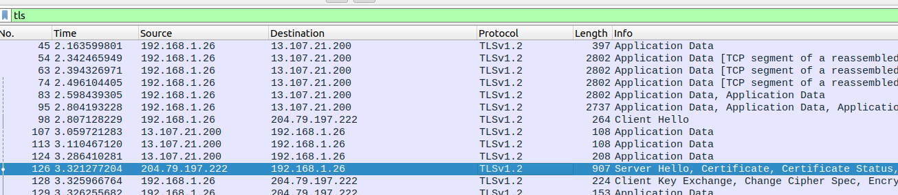<br>
In packet data panel and in `Transport Layer Security` it will have a field name `Session ID`, select it and Apply is as Filter.<br>
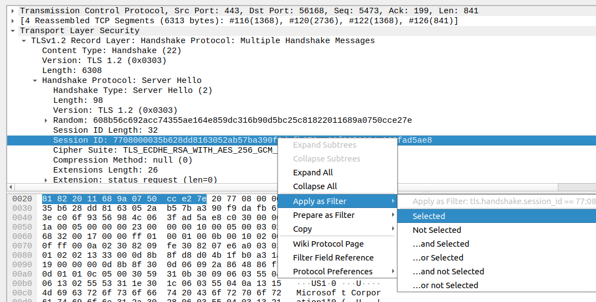<br>
Change value in filter filed into given value from question.<br>
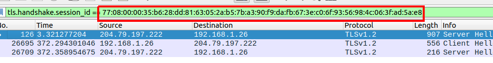.<br>
Open packet data panel, we will see the `Pubkey` field in Transport Layer Security.<br>
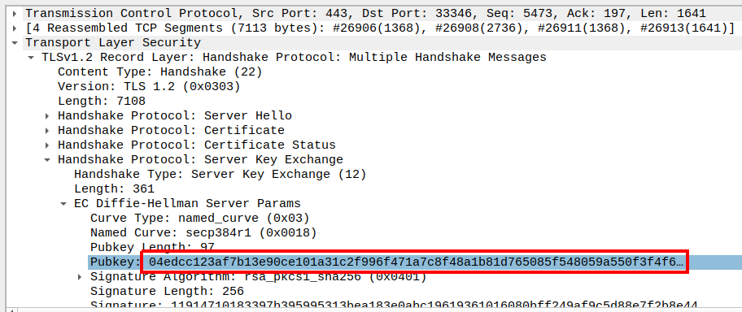<br>
**Answer:** 04edcc123af7b13e90ce101a31c2f996f471a7c8f48a1b81d765085f548059a550f3f4f62ca1f0e8f74d727053074a37bceb2cbdc7ce2a8994dcd76dd6834eefc5438c3b6da929321f3a1366bd14c877cc83e5d0731b7f80a6b80916efd4a23a4d

### Q8. What is the first TLS 1.3 client random that was used to establish a connection with protonmail.com?
Filter `tls` protocol then select a packet with `Client Hello` in info tab. It will have a file named `Server Name` then select Apply as Filter.<br>
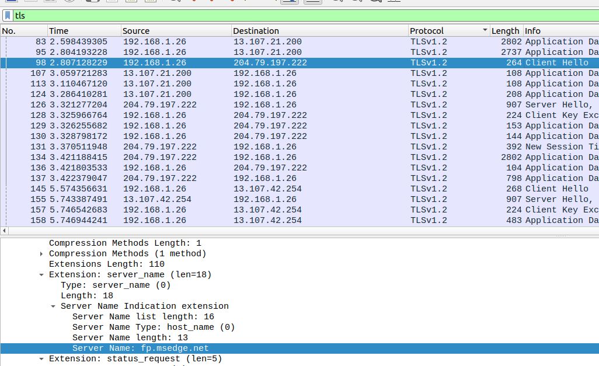<br>
Change this value below to `protonmail.com`.<br>
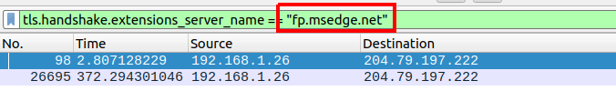<br>
The first packet is 17992, the answer is in the image below.<br>
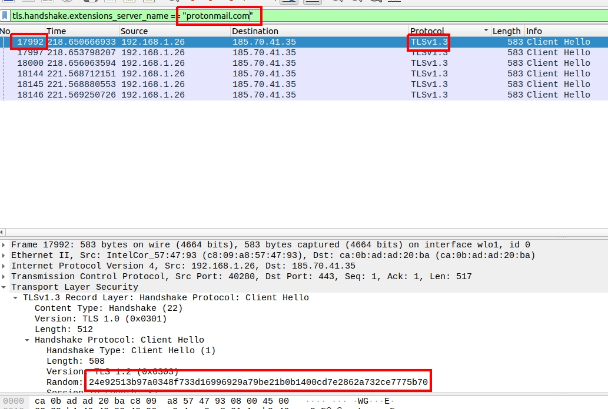<br>
**Answer:** 24e92513b97a0348f733d16996929a79be21b0b1400cd7e2862a732ce7775b70

### Q9. What country is the MAC address of the FTP server registered in? (two words, one space in between)
Filter `ftp` protocol, find the MAC address of FTP Server.<br>
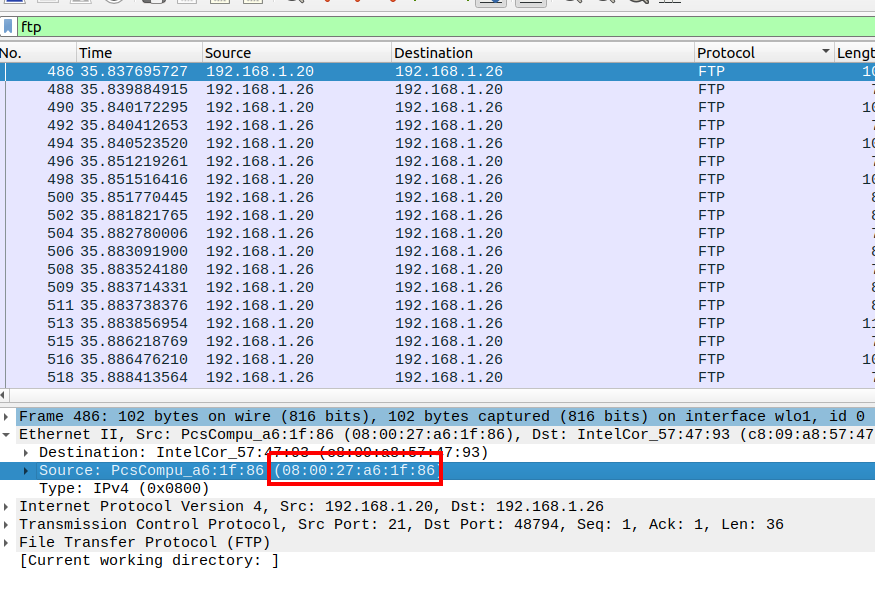<br>
Search it on [https://www.iplocation.net/mac-lookup](https://www.iplocation.net/mac-lookup) to find the vendor.
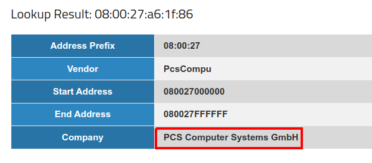<br>
Find the location of the company.<br>
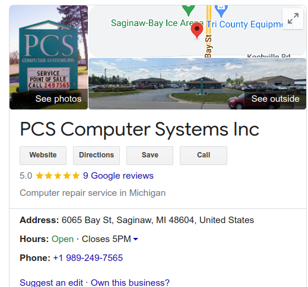<br>
**Answer:** United States

### Q10. What time was a non-standard folder created on the FTP server on the 20th of April? (hh:mm)
Follow TCP Stream for FTP protocol, at stream 11th. The machine perform list current files/folders at current folder. `ftp` is a non-standard folder.
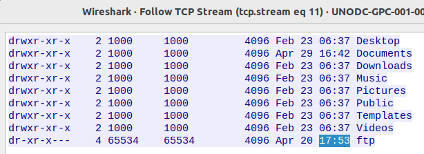<br>
**Answer:** 17:53

### Q11. What domain was the user connected to in packet 27300?
Go to packet 27300, but we can't find any domain in Raw data panel, but we still have a IP.<br>
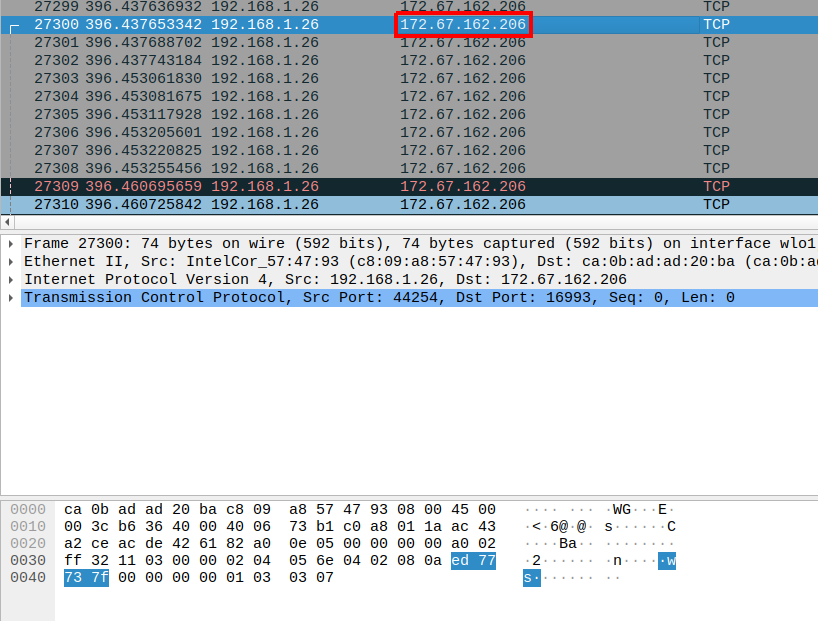<br>
Search it on Google to find the domain.<br>
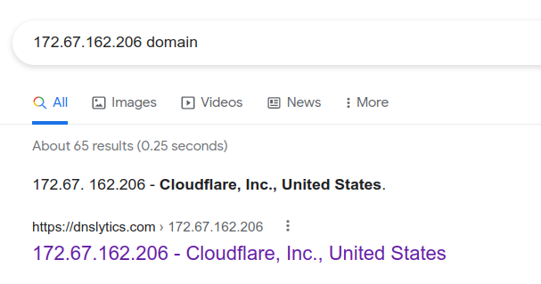<br>
It's of cloudflare.com but this doesn't the answer. Therefore, the user's connection may be redirect from other domain. So, I use `Statistics -> HTTP -> Packet Counter` and found a status code 301.
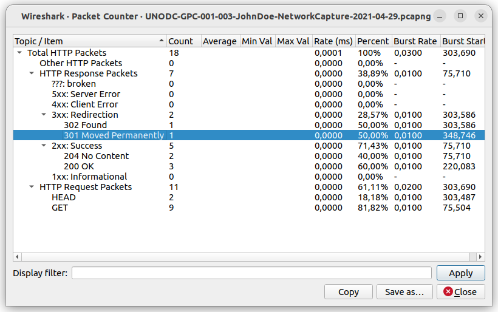<br>
Filter with `http.response.code==301`, follow http stream of this packet.<br>
We see that it redirects to cloudflare.com
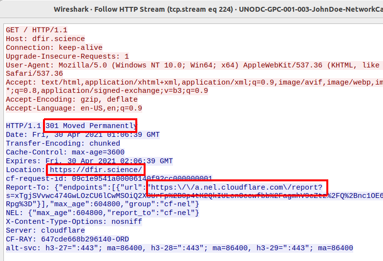<br>
**Answer:** dfir.science
