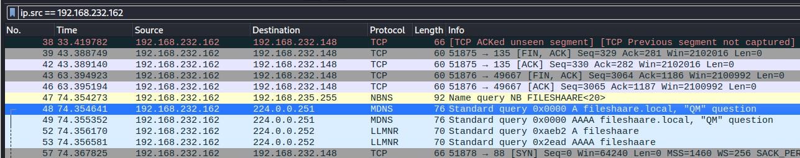
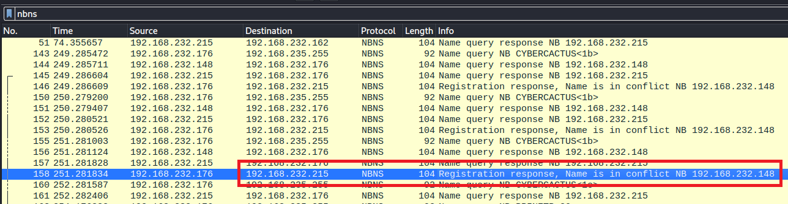
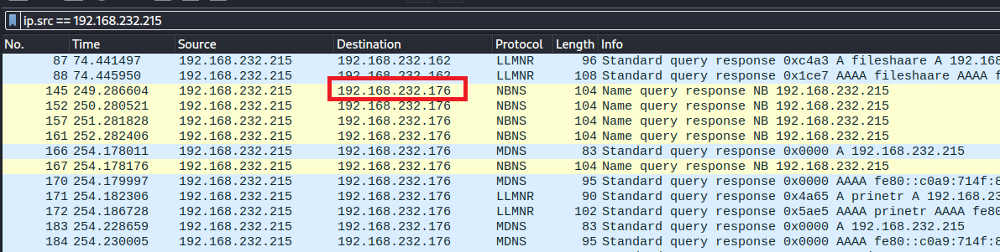
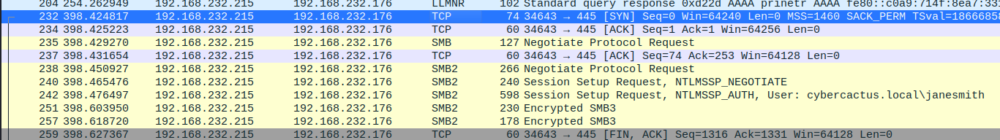
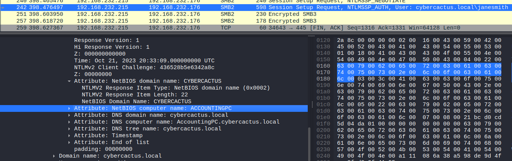

# PoisonedCredentials Blue Team Lab

## Summary
- [PoisonedCredentials Blue Team Lab](#poisonedcredentials-blue-team-lab)
  - [Summary](#summary)
    - [Q1. In the context of the incident described in the scenario, the attacker initiated their actions by taking advantage of benign network traffic from legitimate machines. Can you identify the specific mistyped query made by the machine with the IP address 192.168.232.162?](#q1-in-the-context-of-the-incident-described-in-the-scenario-the-attacker-initiated-their-actions-by-taking-advantage-of-benign-network-traffic-from-legitimate-machines-can-you-identify-the-specific-mistyped-query-made-by-the-machine-with-the-ip-address-192168232162)
    - [Q2. We are investigating a network security incident. For a thorough investigation, we need to determine the IP address of the rogue machine. What is the IP address of the machine acting as the rogue entity?](#q2-we-are-investigating-a-network-security-incident-for-a-thorough-investigation-we-need-to-determine-the-ip-address-of-the-rogue-machine-what-is-the-ip-address-of-the-machine-acting-as-the-rogue-entity)
    - [Q3. During our investigation, it's crucial to identify all affected machines. What is the IP address of the second machine that received poisoned responses from the rogue machine?](#q3-during-our-investigation-its-crucial-to-identify-all-affected-machines-what-is-the-ip-address-of-the-second-machine-that-received-poisoned-responses-from-the-rogue-machine)
    - [Q4. We suspect that user accounts may have been compromised. To assess this, we must determine the username associated with the compromised account. What is the username of the account that the attacker compromised?](#q4-we-suspect-that-user-accounts-may-have-been-compromised-to-assess-this-we-must-determine-the-username-associated-with-the-compromised-account-what-is-the-username-of-the-account-that-the-attacker-compromised)
    - [Q5. As part of our investigation, we aim to understand the extent of the attacker's activities. What is the hostname of the machine that the attacker accessed via SMB?](#q5-as-part-of-our-investigation-we-aim-to-understand-the-extent-of-the-attackers-activities-what-is-the-hostname-of-the-machine-that-the-attacker-accessed-via-smb)

### Q1. In the context of the incident described in the scenario, the attacker initiated their actions by taking advantage of benign network traffic from legitimate machines. Can you identify the specific mistyped query made by the machine with the IP address 192.168.232.162?
Filter with `ip.src == 192.168.232.162`, at the packet no. 48 the attacker call DNS resolve with the mistyped domain name `fileshaare.local`.
 
**Answer:** fileshaare

### Q2. We are investigating a network security incident. For a thorough investigation, we need to determine the IP address of the rogue machine. What is the IP address of the machine acting as the rogue entity?
Filter protocol `nbns` standfor `NetBIOS Name Service`, at the packet no. 58 the IP `192.168.232.176` response to `192.168.232.215` that the BIOS name attacker want to spoof is confict with `192.168.232.148`. 
 
**Answer:** 192.168.232.215

### Q3. During our investigation, it's crucial to identify all affected machines. What is the IP address of the second machine that received poisoned responses from the rogue machine?
Filter `ip.src == 192.168.232.215`, the second IP address that the rogue machine send `LLMNR` is `192.168.232.176`. 
 
**Answer:** 192.168.232.176

### Q4. We suspect that user accounts may have been compromised. To assess this, we must determine the username associated with the compromised account. What is the username of the account that the attacker compromised?
At the end of filter from Q3, the attacker authen SMB with usename `janesmith`. 
 
**Answer:** janesmith

### Q5. As part of our investigation, we aim to understand the extent of the attacker's activities. What is the hostname of the machine that the attacker accessed via SMB?
The packet above is also contain the hostname. 
 
**Answer:** ACCOUNTINGPC
