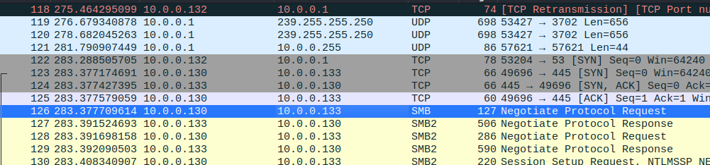
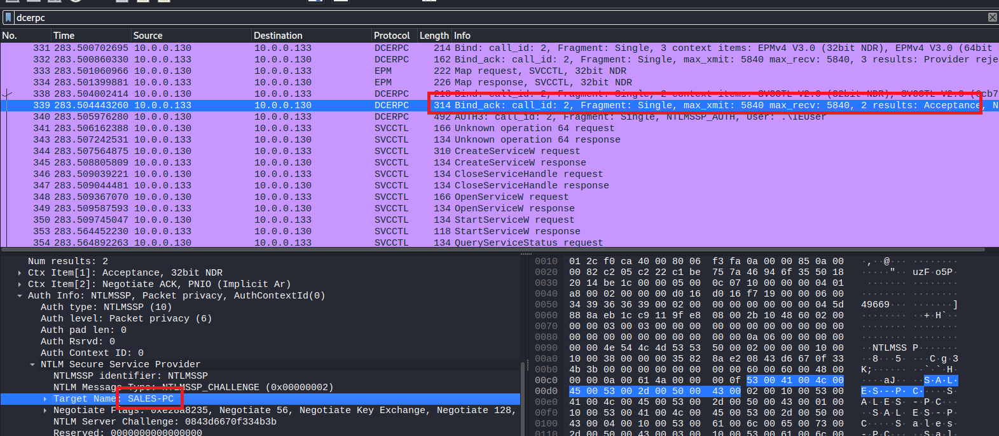
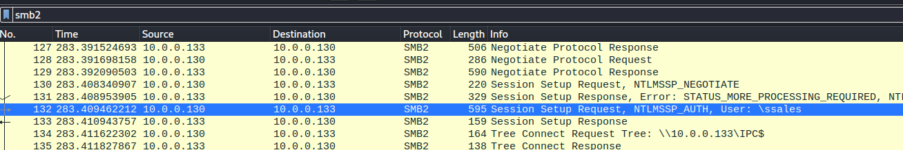
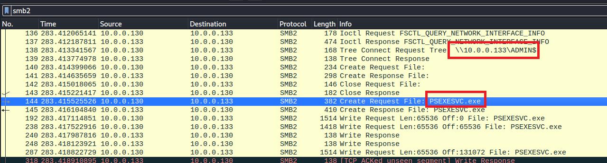
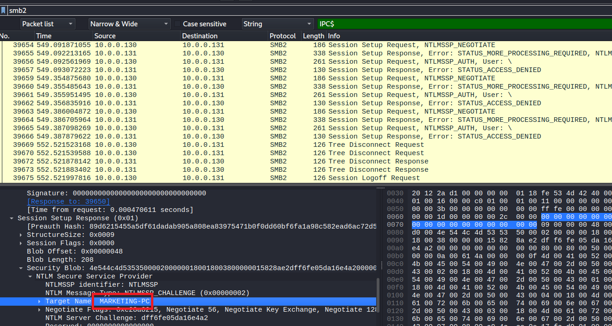

# PsExec Hunt Blue Team Lab

## Summary
- [PsExec Hunt Blue Team Lab](#psexec-hunt-blue-team-lab)
  - [Summary](#summary)
    - [Q1. In order to effectively trace the attacker's activities within our network, can you determine the IP address of the machine where the attacker initially gained access?](#q1-in-order-to-effectively-trace-the-attackers-activities-within-our-network-can-you-determine-the-ip-address-of-the-machine-where-the-attacker-initially-gained-access)
    - [Q2. To fully comprehend the extent of the breach, can you determine the machine's hostname to which the attacker first pivoted?](#q2-to-fully-comprehend-the-extent-of-the-breach-can-you-determine-the-machines-hostname-to-which-the-attacker-first-pivoted)
    - [Q3. After identifying the initial entry point, it's crucial to understand how far the attacker has moved laterally within our network. Knowing the username of the account the attacker used for authentication will give us insights into the extent of the breach. What is the username utilized by the attacker for authentication?](#q3-after-identifying-the-initial-entry-point-its-crucial-to-understand-how-far-the-attacker-has-moved-laterally-within-our-network-knowing-the-username-of-the-account-the-attacker-used-for-authentication-will-give-us-insights-into-the-extent-of-the-breach-what-is-the-username-utilized-by-the-attacker-for-authentication)
    - [Q4. After figuring out how the attacker moved within our network, we need to know what they did on the target machine. What's the name of the service executable the attacker set up on the target?](#q4-after-figuring-out-how-the-attacker-moved-within-our-network-we-need-to-know-what-they-did-on-the-target-machine-whats-the-name-of-the-service-executable-the-attacker-set-up-on-the-target)
    - [Q5. We need to know how the attacker installed the service on the compromised machine to understand the attacker's lateral movement tactics. This can help identify other affected systems. Which network share was used by PsExec to install the service on the target machine?](#q5-we-need-to-know-how-the-attacker-installed-the-service-on-the-compromised-machine-to-understand-the-attackers-lateral-movement-tactics-this-can-help-identify-other-affected-systems-which-network-share-was-used-by-psexec-to-install-the-service-on-the-target-machine)
    - [Q6. We must identify the network share used to communicate between the two machines. Which network share did PsExec use for communication?](#q6-we-must-identify-the-network-share-used-to-communicate-between-the-two-machines-which-network-share-did-psexec-use-for-communication)
    - [Q7. Now that we have a clearer picture of the attacker's activities on the compromised machine, it's important to identify any further lateral movement. What is the machine's hostname to which the attacker attempted to pivot within our network?](#q7-now-that-we-have-a-clearer-picture-of-the-attackers-activities-on-the-compromised-machine-its-important-to-identify-any-further-lateral-movement-what-is-the-machines-hostname-to-which-the-attacker-attempted-to-pivot-within-our-network)

### Q1. In order to effectively trace the attacker's activities within our network, can you determine the IP address of the machine where the attacker initially gained access?
At packet no. 126, the IP `10.0.0.130` init SMB connection to `10.0.0.133`. 
 
**Answer:** 10.0.0.130

### Q2. To fully comprehend the extent of the breach, can you determine the machine's hostname to which the attacker first pivoted?
If the attacker use SMB protocol to pivot to other machine in the network, it will call `DCERPC` protocol for authentication to the target. Filter protocol `DCERPC` and find content `Bind_ack Acceptance`. 
 
At `Packet Detail`, find the `Taregt Name` value. 
**Answer:** Sales-PC

### Q3. After identifying the initial entry point, it's crucial to understand how far the attacker has moved laterally within our network. Knowing the username of the account the attacker used for authentication will give us insights into the extent of the breach. What is the username utilized by the attacker for authentication?
Filter `SMB2` protocol, find the packet with description `Session Setup Request` you will see the username was used in the attack. 
 
**Answer:** ssales

### Q4. After figuring out how the attacker moved within our network, we need to know what they did on the target machine. What's the name of the service executable the attacker set up on the target?
The attacker use PsExec.exe to upload file PSEXESVC.exe to the target. 
**Answer:** PSEXESVC.EXE

### Q5. We need to know how the attacker installed the service on the compromised machine to understand the attacker's lateral movement tactics. This can help identify other affected systems. Which network share was used by PsExec to install the service on the target machine?
From the above image, the attacker use `ADMIN$` to upload file. 
**Answer:** ADMIN$

### Q6. We must identify the network share used to communicate between the two machines. Which network share did PsExec use for communication?
The `IPC$` share is used for communicate with prorgams via namedpipe. 
**Answer:** IPC$

### Q7. Now that we have a clearer picture of the attacker's activities on the compromised machine, it's important to identify any further lateral movement. What is the machine's hostname to which the attacker attempted to pivot within our network?
Follow `SMB2` protocol, you will see some packet has state `ACCESS DENIED` and it also contains the hostname of the machine attacker attempted to lateral. 
 
**Answer:** MARKETING-PC
