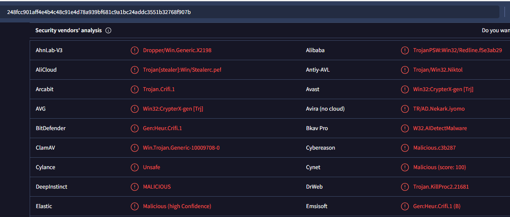
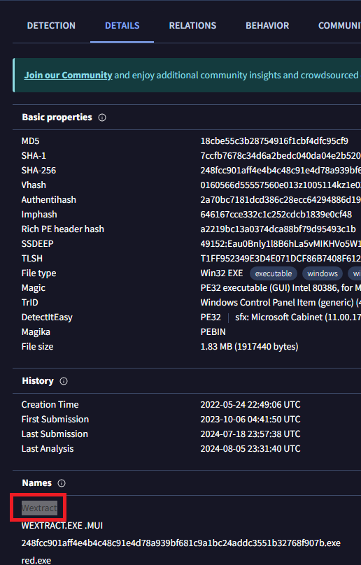
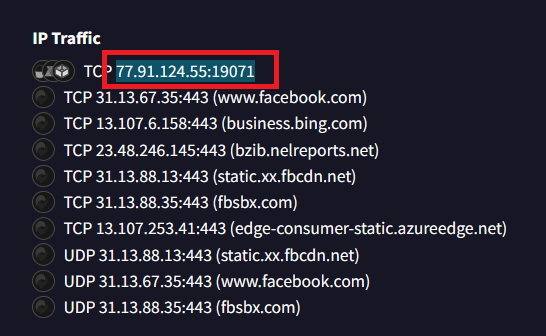
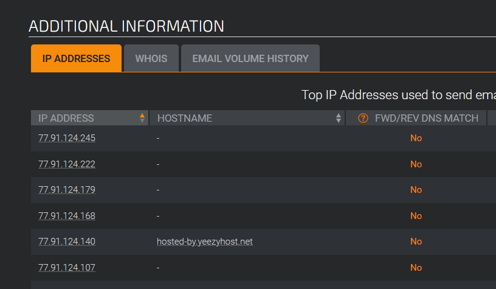
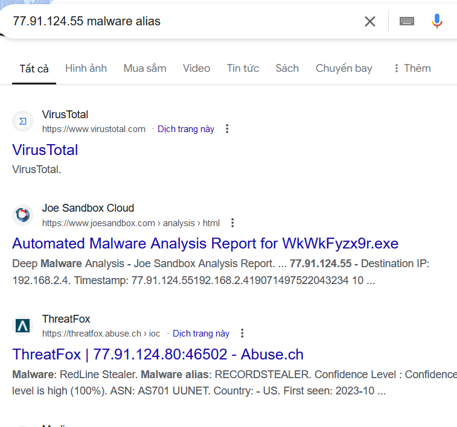

> # Red Stealer

## Summary
- [Summary](#summary)
  - [Q1. Categorizing malware allows for a quicker and easier understanding of the malware, aiding in understanding its distinct behaviors and attack vectors. What's the identified malware's category?](#q1-categorizing-malware-allows-for-a-quicker-and-easier-understanding-of-the-malware-aiding-in-understanding-its-distinct-behaviors-and-attack-vectors-whats-the-identified-malwares-category)
  - [Q2. Clear identification of the malware file name facilitates better communication among the SOC team. What's the file name associated with this malware?](#q2-clear-identification-of-the-malware-file-name-facilitates-better-communication-among-the-soc-team-whats-the-file-name-associated-with-this-malware)
  - [Q3. Knowing the exact time the malware was first seen can help prioritize actions. If the malware is newly detected, it may warrant more urgent containment and eradication efforts compared to older, well-known threats. Can you provide the UTC timestamp of first submission of this malware on VirusTotal?](#q3-knowing-the-exact-time-the-malware-was-first-seen-can-help-prioritize-actions-if-the-malware-is-newly-detected-it-may-warrant-more-urgent-containment-and-eradication-efforts-compared-to-older-well-known-threats-can-you-provide-the-utc-timestamp-of-first-submission-of-this-malware-on-virustotal)
  - [Q4. Understanding the techniques used by malware helps in strategic security planning. What is the MITRE ATT\&CK technique ID for the malware's data collection from the system before exfiltration?](#q4-understanding-the-techniques-used-by-malware-helps-in-strategic-security-planning-what-is-the-mitre-attck-technique-id-for-the-malwares-data-collection-from-the-system-before-exfiltration)
  - [Q5. Following execution, what domain name resolution is performed by the malware?](#q5-following-execution-what-domain-name-resolution-is-performed-by-the-malware)
  - [Q6. Once the malicious IP addresses are identified, network security devices such as firewalls can be configured to block traffic to and from these addresses. Can you provide the IP address and destination port the malware communicates with?](#q6-once-the-malicious-ip-addresses-are-identified-network-security-devices-such-as-firewalls-can-be-configured-to-block-traffic-to-and-from-these-addresses-can-you-provide-the-ip-address-and-destination-port-the-malware-communicates-with)
  - [Q7. If a hosting service is frequently used for malicious activities, security teams can implement a strict filtering rules for all traffic to and from the IPS belonging to that hosting provider. What hosting service does the identified IP belong to?](#q7-if-a-hosting-service-is-frequently-used-for-malicious-activities-security-teams-can-implement-a-strict-filtering-rules-for-all-traffic-to-and-from-the-ips-belonging-to-that-hosting-provider-what-hosting-service-does-the-identified-ip-belong-to)
  - [Q8. YARA rules are designed to identify specific malware patterns and behaviors. What's the name of the YARA rule created by "Varp0s" that detects the identified malware?](#q8-yara-rules-are-designed-to-identify-specific-malware-patterns-and-behaviors-whats-the-name-of-the-yara-rule-created-by-varp0s-that-detects-the-identified-malware)
  - [Q9. Understanding which malware families are targeting the organization helps in strategic security planning for the future and prioritizing resources based on the threat. Can you provide the different malware alias associated with the malicious IP address?](#q9-understanding-which-malware-families-are-targeting-the-organization-helps-in-strategic-security-planning-for-the-future-and-prioritizing-resources-based-on-the-threat-can-you-provide-the-different-malware-alias-associated-with-the-malicious-ip-address)
  - [Q10. By identifying the malware's imported DLLs, we can configure security tools to monitor for the loading or unusual usage of these specific DLLs. Can you provide the DLL utilized by the malware for privilege escalation?](#q10-by-identifying-the-malwares-imported-dlls-we-can-configure-security-tools-to-monitor-for-the-loading-or-unusual-usage-of-these-specific-dlls-can-you-provide-the-dll-utilized-by-the-malware-for-privilege-escalation)

### Q1. Categorizing malware allows for a quicker and easier understanding of the malware, aiding in understanding its distinct behaviors and attack vectors. What's the identified malware's category?
Search the given hash on Virustotal, you will see almost AV labeled it to `Trojan`. 
 
**Answer:** Trojan

### Q2. Clear identification of the malware file name facilitates better communication among the SOC team. What's the file name associated with this malware?
On `Detail` tab, the first name of this file is `Wextract`. 
 
**Answer:** Wextract

### Q3. Knowing the exact time the malware was first seen can help prioritize actions. If the malware is newly detected, it may warrant more urgent containment and eradication efforts compared to older, well-known threats. Can you provide the UTC timestamp of first submission of this malware on VirusTotal?
The answer is on the above image. 
**Answer:** 2023-10-06 04:41:50 UTC

### Q4. Understanding the techniques used by malware helps in strategic security planning. What is the MITRE ATT&CK technique ID for the malware's data collection from the system before exfiltration?
This [link](https://attack.mitre.org/techniques/T1005/), the attacker will search local resource before exfiltration. 
**Answer:** T1005

### Q5. Following execution, what domain name resolution is performed by the malware?
Follow `Behavior` tab in Virustotal, the malware request to `facebook.com`. 
**Answer:** facebook.com

### Q6. Once the malicious IP addresses are identified, network security devices such as firewalls can be configured to block traffic to and from these addresses. Can you provide the IP address and destination port the malware communicates with?
In `IP Traffic`, there is a IP:PORT look malicious. 
 
**Answer:** 77.91.124.55:19071

### Q7. If a hosting service is frequently used for malicious activities, security teams can implement a strict filtering rules for all traffic to and from the IPS belonging to that hosting provider. What hosting service does the identified IP belong to?
Use Cisco Talos to find which host service is belong to the IP. 
 
**Answer:** yeezyhost

### Q8. YARA rules are designed to identify specific malware patterns and behaviors. What's the name of the YARA rule created by "Varp0s" that detects the identified malware?
Use `MalwareBazaar`, [link](https://bazaar.abuse.ch/sample/248fcc901aff4e4b4c48c91e4d78a939bf681c9a1bc24addc3551b32768f907b/) will give you the answer at `YARA Signature`. 
**Answer:** detect_Redline_Stealer

### Q9. Understanding which malware families are targeting the organization helps in strategic security planning for the future and prioritizing resources based on the threat. Can you provide the different malware alias associated with the malicious IP address?
Search on the internet. 
 
**Answer:** RECORDSTEALER

### Q10. By identifying the malware's imported DLLs, we can configure security tools to monitor for the loading or unusual usage of these specific DLLs. Can you provide the DLL utilized by the malware for privilege escalation?
**Answer:** advapi32.dll
