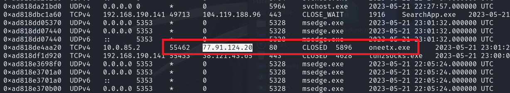

# RedLine 

## Summary
- [RedLine](#redline)
  - [Summary](#summary)
    - [Q1. What is the name of the suspicious process?](#q1-what-is-the-name-of-the-suspicious-process)
    - [Q2. What is the child process name of the suspicious process?](#q2-what-is-the-child-process-name-of-the-suspicious-process)
    - [Q3. What is the memory protection applied to the suspicious process memory region?](#q3-what-is-the-memory-protection-applied-to-the-suspicious-process-memory-region)
    - [Q4. What is the name of the process responsible for the VPN connection?](#q4-what-is-the-name-of-the-process-responsible-for-the-vpn-connection)
    - [Q5. What is the attacker's IP address?](#q5-what-is-the-attackers-ip-address)
    - [Q6. Based on the previous artifacts. What is the name of the malware family?](#q6-based-on-the-previous-artifacts-what-is-the-name-of-the-malware-family)
    - [Q7. What is the full URL of the PHP file that the attacker visited?](#q7-what-is-the-full-url-of-the-php-file-that-the-attacker-visited)
    - [Q8. What is the full path of the malicious executable?](#q8-what-is-the-full-path-of-the-malicious-executable)


### Q1. What is the name of the suspicious process?
First, we need to determine the profile of memory with `imageinfo` plugin.<br>
```shell
$ vol2 imageinfo -f MemoryDump.mem
Suggested Profile(s) : No suggestion (Instantiated with Win10x64_19041)
                     AS Layer1 : SkipDuplicatesAMD64PagedMemory (Kernel AS)
                     AS Layer2 : FileAddressSpace (/home/kali/CTF/cyberdefenders/MemoryDump.mem)
                      PAE type : No PAE
                           DTB : 0x1ad002L
             KUSER_SHARED_DATA : 0xfffff78000000000L
           Image date and time : 2023-05-21 23:02:39 UTC+0000
     Image local date and time : 2023-05-22 01:02:39 +0200
```
Then use plugin `pstree` list process with tree view format.<br>
```shell
$ vol2 -f MemoryDump.mem --profile=Win10x64_19041 pstree  
Volatility Foundation Volatility Framework 2.6.1
Name                                                  Pid   PPid   Thds   Hnds Time
-------------------------------------------------- ------ ------ ------ ------ ----
 0xffffad8185883180:System                              4      0    157      0 2023-05-21 22:27:10 UTC+0000
. 0xffffad81858f2080:Registry                         108      4      4      0 2023-05-21 22:26:54 UTC+0000
. 0xffffad8187835080:MemCompression                  1280      4     62      0 2023-05-21 22:27:49 UTC+0000
. 0xffffad81860dc040:smss.exe                         332      4      2      0 2023-05-21 22:27:10 UTC+0000
 0xffffad8186f2b080:wininit.exe                       552    444      1      0 2023-05-21 22:27:25 UTC+0000
. 0xffffad8186f4d080:services.exe                     676    552      7      0 2023-05-21 22:27:29 UTC+0000
.. 0xffffad818d374280:SecurityHealth                 5136    676      7      0 2023-05-21 22:32:01 UTC+0000
.. 0xffffad818e752080:svchost.exe                    5476    676      9      0 2023-05-21 22:58:08 UTC+0000
.. 0xffffad8187b94080:svchost.exe                    2076    676     10      0 2023-05-21 22:28:19 UTC+0000
.. 0xffffad818c532080:svchost.exe                    6696    676      8      0 2023-05-21 22:34:07 UTC+0000
.. 0xffffad818e88e140:svchost.exe                    7772    676      3      0 2023-05-21 22:36:03 UTC+0000
.. 0xffffad818d09f080:SgrmBroker.exe                 6200    676      7      0 2023-05-21 22:33:42 UTC+0000
.. 0xffffad81896ab080:vmtoolsd.exe                   2144    676     11      0 2023-05-21 22:28:19 UTC+0000
.. 0xffffad8187b34080:svchost.exe                    1892    676     14      0 2023-05-21 22:28:05 UTC+0000
.. 0xffffad818c426080:svchost.exe                    1116    676      6      0 2023-05-21 22:31:00 UTC+0000
.. 0xffffad818945c080:MsMpEng.exe                    1120    676     12      0 2023-05-21 22:10:01 UTC+0000
.. 0xffffad81896ae240:vm3dservice.ex                 2152    676      2      0 2023-05-21 22:28:19 UTC+0000
... 0xffffad8186619200:vm3dservice.ex                2404   2152      2      0 2023-05-21 22:28:32 UTC+0000
.. 0xffffad8187a112c0:svchost.exe                    1644    676      6      0 2023-05-21 22:27:58 UTC+0000
.. 0xffffad8187a2d2c0:svchost.exe                    1652    676     10      0 2023-05-21 22:27:58 UTC+0000
.. 0xffffad8187721240:svchost.exe                     448    676     54      0 2023-05-21 22:27:41 UTC+0000
... 0xffffad8189d07300:taskhostw.exe                 1600    448     10      0 2023-05-21 22:30:09 UTC+0000
... 0xffffad818d3d6080:oneetx.exe                    5480    448      6      0 2023-05-21 23:03:00 UTC+0000
... 0xffffad8189b30080:taskhostw.exe                 3876    448      8      0 2023-05-21 22:08:02 UTC+0000
... 0xffffad8189e94280:sihost.exe                    1392    448     11      0 2023-05-21 22:30:08 UTC+0000
... 0xffffad818dc5d080:taskhostw.exe                 6048    448      5      0 2023-05-21 22:40:20 UTC+0000
.. 0xffffad818ce06240:SearchIndexer.                 4228    676     15      0 2023-05-21 22:31:27 UTC+0000
.. 0xffffad818d07a080:svchost.exe                    3608    676      3      0 2023-05-21 22:41:28 UTC+0000
.. 0xffffad81896b3300:VGAuthService.                 2200    676      2      0 2023-05-21 22:28:19 UTC+0000
.. 0xffffad818dc88080:TrustedInstall                 6596    676      4      0 2023-05-21 22:58:13 UTC+0000
.. 0xffffad81877972c0:svchost.exe                    1196    676     34      0 2023-05-21 22:27:46 UTC+0000
.. 0xffffad8186f4a2c0:svchost.exe                    1232    676      7      0 2023-05-21 22:29:39 UTC+0000
.. 0xffffad8187758280:svchost.exe                     752    676     21      0 2023-05-21 22:27:43 UTC+0000
... 0xffffad8189c8b280:ctfmon.exe                    3204    752     12      0 2023-05-21 22:30:11 UTC+0000
.. 0xffffad8189d7c2c0:svchost.exe                    1064    676     15      0 2023-05-21 22:30:09 UTC+0000
.. 0xffffad818e888080:VSSVC.exe                      4340    676      3      0 2023-05-21 23:01:06 UTC+0000
.. 0xffffad8187acb200:spoolsv.exe                    1840    676     10      0 2023-05-21 22:28:03 UTC+0000
.. 0xffffad818761d240:svchost.exe                     824    676     22      0 2023-05-21 22:27:32 UTC+0000
... 0xffffad818cd93300:RuntimeBroker.                4116    824      3      0 2023-05-21 22:31:24 UTC+0000
... 0xffffad81876e8080:RuntimeBroker.                5656    824      0 ------ 2023-05-21 21:58:19 UTC+0000
... 0xffffad8185962080:RuntimeBroker.                5704    824      5      0 2023-05-21 22:32:44 UTC+0000
... 0xffffad818cad3240:StartMenuExper                3160    824     14      0 2023-05-21 22:31:21 UTC+0000
... 0xffffad818eb18080:ShellExperienc                6076    824     14      0 2023-05-21 22:11:36 UTC+0000
... 0xffffad818e84f300:ApplicationFra                7312    824     10      0 2023-05-21 22:35:44 UTC+0000
... 0xffffad818e8bb080:RuntimeBroker.                7336    824      2      0 2023-05-21 22:11:39 UTC+0000
... 0xffffad818e780080:TiWorker.exe                  2332    824      4      0 2023-05-21 22:58:13 UTC+0000
... 0xffffad818de5d080:HxTsr.exe                     5808    824      0 ------ 2023-05-21 21:59:58 UTC+0000
... 0xffffad818e893080:smartscreen.ex                7540    824     14      0 2023-05-21 23:02:26 UTC+0000
... 0xffffad818d176080:dllhost.exe                   1764    824      7      0 2023-05-21 22:32:48 UTC+0000
... 0xffffad818e6db080:TextInputHost.                8952    824     10      0 2023-05-21 21:59:11 UTC+0000
... 0xffffad818c09a080:RuntimeBroker.                4448    824      9      0 2023-05-21 22:31:33 UTC+0000
... 0xffffad818c054080:WmiPrvSE.exe                  3944    824     13      0 2023-05-21 22:30:44 UTC+0000
... 0xffffad8186f49080:SkypeBackgroun                 372    824      3      0 2023-05-21 22:10:00 UTC+0000
... 0xffffad818d099080:SearchApp.exe                 1916    824     24      0 2023-05-21 22:33:05 UTC+0000
... 0xffffad818eec8080:RuntimeBroker.                8264    824      4      0 2023-05-21 22:40:33 UTC+0000
... 0xffffad818d3ac080:SkypeApp.exe                  6644    824     49      0 2023-05-21 22:41:52 UTC+0000
... 0xffffad818ccc4080:SearchApp.exe                 7160    824     57      0 2023-05-21 22:39:13 UTC+0000
.. 0xffffad8185861280:msdtc.exe                       832    676      9      0 2023-05-21 22:29:25 UTC+0000
.. 0xffffad818ef86080:svchost.exe                    5964    676      5      0 2023-05-21 22:27:56 UTC+0000
.. 0xffffad81878020c0:svchost.exe                    1376    676     15      0 2023-05-21 22:27:49 UTC+0000
.. 0xffffad818d431080:svchost.exe                    8708    676      5      0 2023-05-21 22:57:33 UTC+0000
.. 0xffffad818796c2c0:svchost.exe                    1448    676     30      0 2023-05-21 22:27:52 UTC+0000
.. 0xffffad81876802c0:svchost.exe                     952    676     12      0 2023-05-21 22:27:36 UTC+0000
.. 0xffffad818774c080:svchost.exe                    1012    676     19      0 2023-05-21 22:27:43 UTC+0000
.. 0xffffad818c4212c0:svchost.exe                    3004    676      7      0 2023-05-21 22:30:55 UTC+0000
.. 0xffffad8185907080:dllhost.exe                    3028    676     12      0 2023-05-21 22:29:20 UTC+0000
.. 0xffffad81879752c0:svchost.exe                    1496    676     12      0 2023-05-21 22:27:52 UTC+0000
... 0xffffad818df2e080:audiodg.exe                   6324   1496      4      0 2023-05-21 22:42:56 UTC+0000
.. 0xffffad8187b65240:svchost.exe                    2024    676      7      0 2023-05-21 22:28:11 UTC+0000
.. 0xffffad8189b27080:svchost.exe                    2044    676     28      0 2023-05-21 22:49:29 UTC+0000
. 0xffffad8186fc6080:lsass.exe                        696    552     10      0 2023-05-21 22:27:29 UTC+0000
. 0xffffad818761b0c0:fontdrvhost.ex                   852    552      5      0 2023-05-21 22:27:33 UTC+0000
 0xffffad81861cd080:csrss.exe                         452    444     12      0 2023-05-21 22:27:22 UTC+0000
 0xffffad8186f450c0:winlogon.exe                      588    520      5      0 2023-05-21 22:27:25 UTC+0000
. 0xffffad818761f140:fontdrvhost.ex                   860    588      5      0 2023-05-21 22:27:33 UTC+0000
. 0xffffad81876e4340:dwm.exe                         1016    588     15      0 2023-05-21 22:27:38 UTC+0000
. 0xffffad818c02f340:userinit.exe                    3556    588      0 ------ 2023-05-21 22:30:28 UTC+0000
.. 0xffffad818c047340:explorer.exe                   3580   3556     76      0 2023-05-21 22:30:28 UTC+0000
... 0xffffad818db45080:notepad.exe                   5636   3580      1      0 2023-05-21 22:46:50 UTC+0000
... 0xffffad818e578080:Outline.exe                   6724   3580      0 ------ 2023-05-21 22:36:09 UTC+0000
.... 0xffffad818de82340:tun2socks.exe                4628   6724      0 ------ 2023-05-21 22:40:10 UTC+0000
.... 0xffffad818e88b080:Outline.exe                  4224   6724      0 ------ 2023-05-21 22:36:23 UTC+0000
... 0xffffad8189796300:vmtoolsd.exe                  3252   3580      8      0 2023-05-21 22:31:59 UTC+0000
... 0xffffad818d0980c0:msedge.exe                    5328   3580     54      0 2023-05-21 22:32:02 UTC+0000
.... 0xffffad818c553080:msedge.exe                   5156   5328     14      0 2023-05-21 22:28:22 UTC+0000
.... 0xffffad818d75f080:msedge.exe                   1144   5328     18      0 2023-05-21 22:32:38 UTC+0000
.... 0xffffad818d7a1080:msedge.exe                   6292   5328     20      0 2023-05-21 22:06:15 UTC+0000
.... 0xffffad8187a39080:msedge.exe                   8896   5328     18      0 2023-05-21 22:28:21 UTC+0000
.... 0xffffad818d7b3080:msedge.exe                   5340   5328     10      0 2023-05-21 22:32:39 UTC+0000
.... 0xffffad818dee5080:msedge.exe                   7964   5328     19      0 2023-05-21 22:22:09 UTC+0000
.... 0xffffad818d515080:msedge.exe                   4396   5328      7      0 2023-05-21 22:32:19 UTC+0000
.... 0xffffad818e54c340:msedge.exe                   2388   5328     18      0 2023-05-21 22:05:35 UTC+0000
.... 0xffffad818c0ea080:msedge.exe                   6544   5328     18      0 2023-05-21 22:22:35 UTC+0000
.... 0xffffad818d75b080:msedge.exe                   4544   5328     14      0 2023-05-21 22:32:39 UTC+0000
... 0xffffad818ef81080:FTK Imager.exe                8920   3580     20      0 2023-05-21 23:02:28 UTC+0000
... 0xffffad818d143080:FTK Imager.exe                2228   3580     10      0 2023-05-21 22:43:56 UTC+0000
... 0xffffad818979d080:SecurityHealth                 464   3580      3      0 2023-05-21 22:31:59 UTC+0000
 0xffffad8186f1b140:csrss.exe                         528    520     14      0 2023-05-21 22:27:25 UTC+0000
 0xffffad8189b41080:oneetx.exe                       5896   8844      5      0 2023-05-21 22:30:56 UTC+0000
. 0xffffad818d1912c0:rundll32.exe                    7732   5896      1      0 2023-05-21 22:31:53 UTC+0000
```
The process `oneetx.exe` is flagged as malware when we search it on Google.<br>
**Answer:** oneetx.exe

### Q2. What is the child process name of the suspicious process?
From the above, the child process is `rundll32.exe`.<br>
**Answer:** rundll32.exe

### Q3. What is the memory protection applied to the suspicious process memory region?
Use plugin `malfind` to find hidden and injected code. What malfind does is it finds a suspicious VAD memory region that has PAGE_EXECUTE_READWRITE memory protection in a process.
<br>
**Answer:** PAGE_EXECUTE_READWRITE

### Q4. What is the name of the process responsible for the VPN connection?
From the Q2, the is a process named `Outline.exe` <= This is the process responsible for the Outline VPN connection.<br>
**Answer:** Outline.exe

### Q5. What is the attacker's IP address?
Because Volatility 2 does not support this profile, so we change to Volatility 3 at this time. Use plugin `windows.netscan` to list all connection of the machine.<br>
<br>
The process `oneetx.exe` connect to the above IP address.<br>
**Answer:** 77.91.124.20

### Q6. Based on the previous artifacts. What is the name of the malware family?
The result is in this link [link](https://bazaar.abuse.ch/sample/74b102111f7d344a2c0cb7a77d73c968aff7f6a4b67c3457643d9a61c12d2aef/), paste the IP address of attacker to see which malware family is belong to.<br>
<br>
**Answer:** RedLine Stealer

### Q7. What is the full URL of the PHP file that the attacker visited?
Use `windows.memmap` to dump process oneetx.exe, then use `strings` to get all php string in it.<br>
```shell
$ strings pid.5896.dmp | grep -i php
http://77.91.124.20/store/games/index.php
http://77.91.124.20/store/games/index.php
http://77.91.124.20/store/games/index.php
```
**Answer:** http://77.91.124.20/store/games/index.php

### Q8. What is the full path of the malicious executable?
Use `windows.filescan` to scan all file are running on the machine and redirect all output to file `filescan_out`.<br>
<br>
**Answer:** C:\Users\Tammam\AppData\Local\Temp\c3912af058\oneetx.exe
