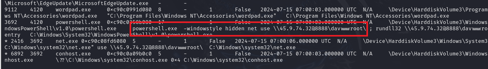
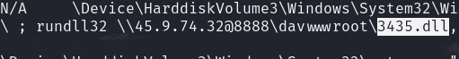
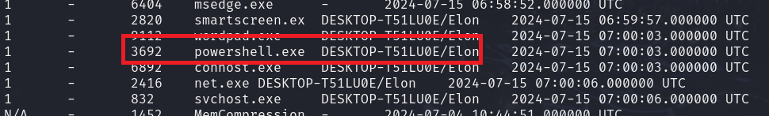

> # Reveal

## Summary
- [Summary](#summary)
  - [Q1. Identifying the name of the malicious process helps in understanding the nature of the attack. What is the name of the malicious process?](#q1-identifying-the-name-of-the-malicious-process-helps-in-understanding-the-nature-of-the-attack-what-is-the-name-of-the-malicious-process)
  - [Q2. Knowing the parent process ID (PID) of the malicious process aids in tracing the process hierarchy and understanding the attack flow. What is the parent PID of the malicious process?](#q2-knowing-the-parent-process-id-pid-of-the-malicious-process-aids-in-tracing-the-process-hierarchy-and-understanding-the-attack-flow-what-is-the-parent-pid-of-the-malicious-process)
  - [Q3. Determining the file name used by the malware for executing the second-stage payload is crucial for identifying subsequent malicious activities. What is the file name that the malware uses to execute the second-stage payload?\\](#q3-determining-the-file-name-used-by-the-malware-for-executing-the-second-stage-payload-is-crucial-for-identifying-subsequent-malicious-activities-what-is-the-file-name-that-the-malware-uses-to-execute-the-second-stage-payload)
  - [Q4. Identifying the shared directory on the remote server helps trace the resources targeted by the attacker. What is the name of the shared directory being accessed on the remote server?](#q4-identifying-the-shared-directory-on-the-remote-server-helps-trace-the-resources-targeted-by-the-attacker-what-is-the-name-of-the-shared-directory-being-accessed-on-the-remote-server)
  - [Q5. What is the MITRE sub-technique ID used by the malware to execute the second-stage payload?](#q5-what-is-the-mitre-sub-technique-id-used-by-the-malware-to-execute-the-second-stage-payload)
  - [Q6. Identifying the username under which the malicious process runs helps in assessing the compromised account and its potential impact. What is the username that the malicious process runs under?](#q6-identifying-the-username-under-which-the-malicious-process-runs-helps-in-assessing-the-compromised-account-and-its-potential-impact-what-is-the-username-that-the-malicious-process-runs-under)
  - [Q7. Knowing the name of the malware family is essential for correlating the attack with known threats and developing appropriate defenses. What is the name of the malware family?](#q7-knowing-the-name-of-the-malware-family-is-essential-for-correlating-the-attack-with-known-threats-and-developing-appropriate-defenses-what-is-the-name-of-the-malware-family)

### Q1. Identifying the name of the malicious process helps in understanding the nature of the attack. What is the name of the malicious process?
Use Volatility 3 for analysing the memory dump with plugin `windows.pstree`. 
 
The process `powershell.exe` create process `net use`. 
**Answer:** powershell.exe

### Q2. Knowing the parent process ID (PID) of the malicious process aids in tracing the process hierarchy and understanding the attack flow. What is the parent PID of the malicious process?
From the above image, the PPID of malicious process is 4120. 
**Answer:** 4120

### Q3. Determining the file name used by the malware for executing the second-stage payload is crucial for identifying subsequent malicious activities. What is the file name that the malware uses to execute the second-stage payload?\
The attacker use `rundll32` to execute the payload in `3435.dll`. 
 
**Answer:** 3435.dll

### Q4. Identifying the shared directory on the remote server helps trace the resources targeted by the attacker. What is the name of the shared directory being accessed on the remote server?
The attacker use the share name `davwwwroot` on server `45.9.74.32@8888`. 
**Answer:** davwwwroot

### Q5. What is the MITRE sub-technique ID used by the malware to execute the second-stage payload?
Follow this [link](https://attack.mitre.org/techniques/T1218/011/), you will see the ID of this technique. 
**Answer:** T1218.011 

### Q6. Identifying the username under which the malicious process runs helps in assessing the compromised account and its potential impact. What is the username that the malicious process runs under?
Use plugin `windows.sessions` to find which user is belong to the process `powershell.exe` with PID 3692. 
 
**Answer:** Elon

### Q7. Knowing the name of the malware family is essential for correlating the attack with known threats and developing appropriate defenses. What is the name of the malware family?
Searhc on the internet with IP `45.9.74.32`, you will see this [link](https://bazaar.abuse.ch/sample/7365c4cf371b0f66c7c948e14ae33c9a00a81929cf254bd064ec32b371756ff6/) 
**Answer:** StrelaStealer
