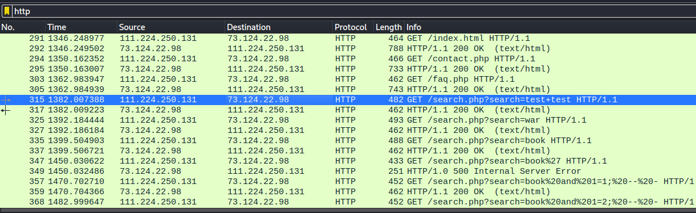
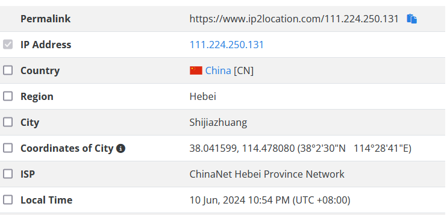
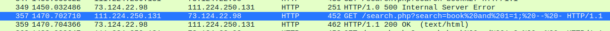
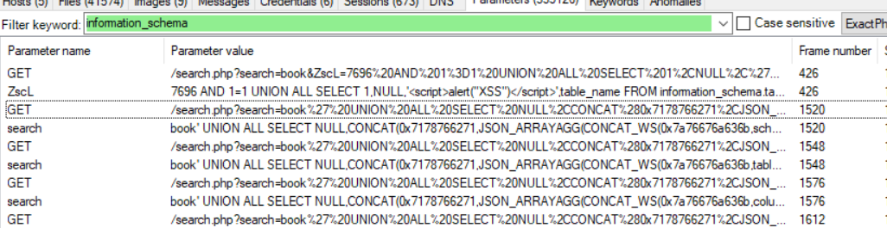
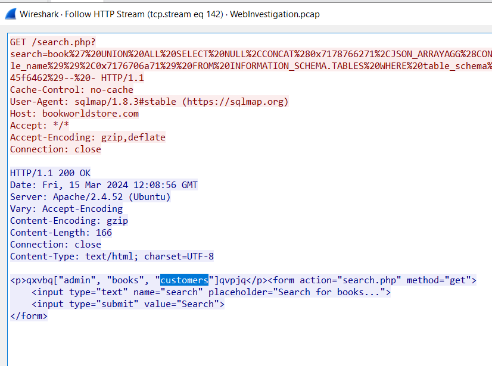
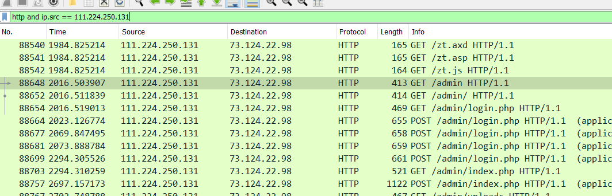
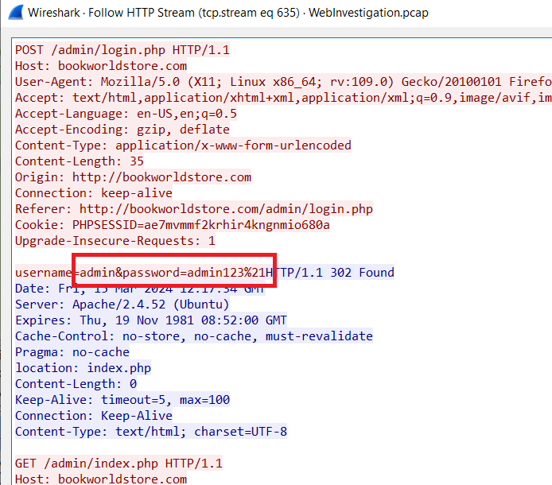
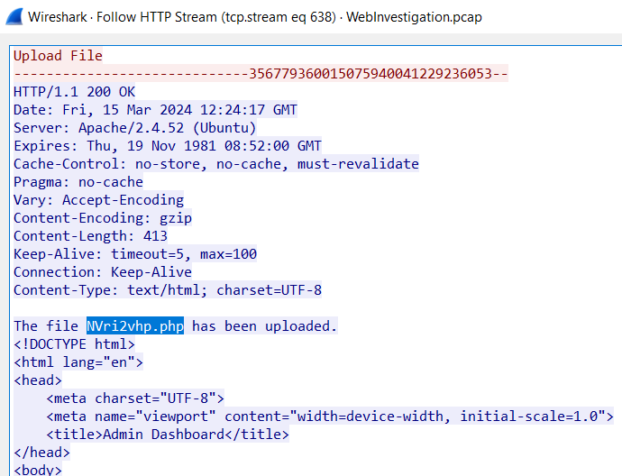

# Web Investigation Blue Team Lab

## Summary
- [Web Investigation Blue Team Lab](#web-investigation-blue-team-lab)
  - [Summary](#summary)
    - [Q1. By knowing the attacker's IP, we can analyze all logs and actions related to that IP and determine the extent of the attack, the duration of the attack, and the techniques used. Can you provide the attacker's IP?](#q1-by-knowing-the-attackers-ip-we-can-analyze-all-logs-and-actions-related-to-that-ip-and-determine-the-extent-of-the-attack-the-duration-of-the-attack-and-the-techniques-used-can-you-provide-the-attackers-ip)
    - [Q2. If the geographical origin of an IP address is known to be from a region that has no business or expected traffic with our network, this can be an indicator of a targeted attack. Can you determine the origin city of the attacker?\\](#q2-if-the-geographical-origin-of-an-ip-address-is-known-to-be-from-a-region-that-has-no-business-or-expected-traffic-with-our-network-this-can-be-an-indicator-of-a-targeted-attack-can-you-determine-the-origin-city-of-the-attacker)
    - [Q3. Identifying the exploited script allows security teams to understand exactly which vulnerability was used in the attack. This knowledge is critical for finding the appropriate patch or workaround to close the security gap and prevent future exploitation. Can you provide the vulnerable script name?](#q3-identifying-the-exploited-script-allows-security-teams-to-understand-exactly-which-vulnerability-was-used-in-the-attack-this-knowledge-is-critical-for-finding-the-appropriate-patch-or-workaround-to-close-the-security-gap-and-prevent-future-exploitation-can-you-provide-the-vulnerable-script-name)
    - [Q4. Establishing the timeline of an attack, starting from the initial exploitation attempt, What's the complete request URI of the first SQLi attempt by the attacker?](#q4-establishing-the-timeline-of-an-attack-starting-from-the-initial-exploitation-attempt-whats-the-complete-request-uri-of-the-first-sqli-attempt-by-the-attacker)
    - [Q5. Can you provide the complete request URI that was used to read the web server available databases?](#q5-can-you-provide-the-complete-request-uri-that-was-used-to-read-the-web-server-available-databases)
    - [Q6. Assessing the impact of the breach and data access is crucial, including the potential harm to the organization's reputation. What's the table name containing the website users data?](#q6-assessing-the-impact-of-the-breach-and-data-access-is-crucial-including-the-potential-harm-to-the-organizations-reputation-whats-the-table-name-containing-the-website-users-data)
    - [Q7. The website directories hidden from the public could serve as an unauthorized access point or contain sensitive functionalities not intended for public access. Can you provide name of the directory discovered by the attacker?](#q7-the-website-directories-hidden-from-the-public-could-serve-as-an-unauthorized-access-point-or-contain-sensitive-functionalities-not-intended-for-public-access-can-you-provide-name-of-the-directory-discovered-by-the-attacker)
    - [Q8. Knowing which credentials were used allows us to determine the extent of account compromise. What's the credentials used by the attacker for logging in?](#q8-knowing-which-credentials-were-used-allows-us-to-determine-the-extent-of-account-compromise-whats-the-credentials-used-by-the-attacker-for-logging-in)
    - [Q9. We need to determine if the attacker gained further access or control on our web server. What's the name of the malicious script uploaded by the attacker?](#q9-we-need-to-determine-if-the-attacker-gained-further-access-or-control-on-our-web-server-whats-the-name-of-the-malicious-script-uploaded-by-the-attacker)

### Q1. By knowing the attacker's IP, we can analyze all logs and actions related to that IP and determine the extent of the attack, the duration of the attack, and the techniques used. Can you provide the attacker's IP?
Filter with HTTP protocol, you will see the IP address `111.224.250.131` send many requests to URI `search.php` with payload `%27` standfor `'` 
 
**Asnwer:** 111.224.250.131

### Q2. If the geographical origin of an IP address is known to be from a region that has no business or expected traffic with our network, this can be an indicator of a targeted attack. Can you determine the origin city of the attacker?\
Use [https://www.ip2location.com](https://www.ip2location.com) for the above IP. 
 
**Answer:** Shijiazhuang

### Q3. Identifying the exploited script allows security teams to understand exactly which vulnerability was used in the attack. This knowledge is critical for finding the appropriate patch or workaround to close the security gap and prevent future exploitation. Can you provide the vulnerable script name?
The attacker try to find SQL injection vuln in `search.php`. 
**Answer:** search.php

### Q4. Establishing the timeline of an attack, starting from the initial exploitation attempt, What's the complete request URI of the first SQLi attempt by the attacker?
At packet no. 357, the attacker send the first SQLi to the server. 
 
**Answer:** /search.php?search=book%20and%201=1;%20--%20-

### Q5. Can you provide the complete request URI that was used to read the web server available databases?
At packet no. 1520 contain the payload to retrive all databases on the server from `information_schema` table or you can view in `NetworkMiner`. 
 
**Answer:** /search.php?search=book%27%20UNION%20ALL%20SELECT%20NULL%2CCONCAT%280x7178766271%2CJSON_ARRAYAGG%28CONCAT_WS%280x7a76676a636b%2Cschema_name%29%29%2C0x7176706a71%29%20FROM%20INFORMATION_SCHEMA.SCHEMATA--%20-

### Q6. Assessing the impact of the breach and data access is crucial, including the potential harm to the organization's reputation. What's the table name containing the website users data?
The attacker continue call to `information_schema.tables` to get all the tables in the database. 
Follow HTTP stream for the packet no. 1576, you will see all tables's name. 
 
**Answer:** customers

### Q7. The website directories hidden from the public could serve as an unauthorized access point or contain sensitive functionalities not intended for public access. Can you provide name of the directory discovered by the attacker?
The attacker discovery uri `/admin/` in the webserver. 
 
**Answer:** /admin/

### Q8. Knowing which credentials were used allows us to determine the extent of account compromise. What's the credentials used by the attacker for logging in?
At packet no. 88699, the attacker succesfully login into Admin's dashboard with acccount admin / admin123!.  
 
**AnsweR:** admin:admin123!

### Q9. We need to determine if the attacker gained further access or control on our web server. What's the name of the malicious script uploaded by the attacker?
Filter method `POST`, follow HTTP stream in the last packet you will the name of script uploaded by the attacker. 
 
**Answer:** NVri2vhp.php
