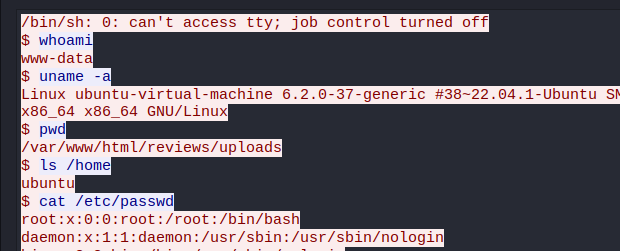

# WebStrike Blue Team Lab

## Summary
- [WebStrike Blue Team Lab](#webstrike-blue-team-lab)
  - [Summary](#summary)
    - [Q1. Understanding the geographical origin of the attack aids in geo-blocking measures and threat intelligence analysis. What city did the attack originate from?](#q1-understanding-the-geographical-origin-of-the-attack-aids-in-geo-blocking-measures-and-threat-intelligence-analysis-what-city-did-the-attack-originate-from)
    - [Q2. Knowing the attacker's user-agent assists in creating robust filtering rules. What's the attacker's user agent?](#q2-knowing-the-attackers-user-agent-assists-in-creating-robust-filtering-rules-whats-the-attackers-user-agent)
    - [Q3. We need to identify if there were potential vulnerabilities exploited. What's the name of the malicious web shell uploaded?](#q3-we-need-to-identify-if-there-were-potential-vulnerabilities-exploited-whats-the-name-of-the-malicious-web-shell-uploaded)
    - [Q4. Knowing the directory where files uploaded are stored is important for reinforcing defenses against unauthorized access. Which directory is used by the website to store the uploaded files?](#q4-knowing-the-directory-where-files-uploaded-are-stored-is-important-for-reinforcing-defenses-against-unauthorized-access-which-directory-is-used-by-the-website-to-store-the-uploaded-files)
    - [Q5. Identifying the port utilized by the web shell helps improve firewall configurations for blocking unauthorized outbound traffic. What port was used by the malicious web shell?](#q5-identifying-the-port-utilized-by-the-web-shell-helps-improve-firewall-configurations-for-blocking-unauthorized-outbound-traffic-what-port-was-used-by-the-malicious-web-shell)
    - [Q6. Understanding the value of compromised data assists in prioritizing incident response actions. What file was the attacker trying to exfiltrate?](#q6-understanding-the-value-of-compromised-data-assists-in-prioritizing-incident-response-actions-what-file-was-the-attacker-trying-to-exfiltrate)

### Q1. Understanding the geographical origin of the attack aids in geo-blocking measures and threat intelligence analysis. What city did the attack originate from?
Open the given file in Wireshark, the packet no. 1 start the handshake then start send http request to the server. 
 
Find the location of IP `117.11.88.124` in [https://www.ip2location.com/](https://www.ip2location.com/). 
 
**Answer:** Tianjin

### Q2. Knowing the attacker's user-agent assists in creating robust filtering rules. What's the attacker's user agent?
Follow HTTP stream you will see the User-Agent of the attacker. 
 
**Answer:** Mozilla/5.0 (X11; Linux x86_64; rv:109.0) Gecko/20100101 Firefox/115.0

### Q3. We need to identify if there were potential vulnerabilities exploited. What's the name of the malicious web shell uploaded?
Search for the string `upload` you will see attacker request to `upload.php`, follow HTTP stream the attacker upload a filename `image.php` but receive the response `Invalid file format.` 
 
In the second request to `upload.php`, the attacker upload file `image.jpg.php` and successfully upload to the server. 
 
The image is actully a bash file to create a reverse shell to 117.11.88.124:8080
**Answer:** image.jpg.php

### Q4. Knowing the directory where files uploaded are stored is important for reinforcing defenses against unauthorized access. Which directory is used by the website to store the uploaded files?
We already known the IP and port of the attacker was used to get reverse shell, filter with `tcp.dstport == 8080` then follow TCP stream to find commands attacker had run on the server. 
 
The attacker has run `pwd` to display current directory. 
**Answer:** /reviews/uploads/

### Q5. Identifying the port utilized by the web shell helps improve firewall configurations for blocking unauthorized outbound traffic. What port was used by the malicious web shell?
**Answer:** 8080

### Q6. Understanding the value of compromised data assists in prioritizing incident response actions. What file was the attacker trying to exfiltrate?
The attacker try to upload the file `/etc/passwd` to his server through `curl -X POST -d`. 
 
**Answer:** passwd
